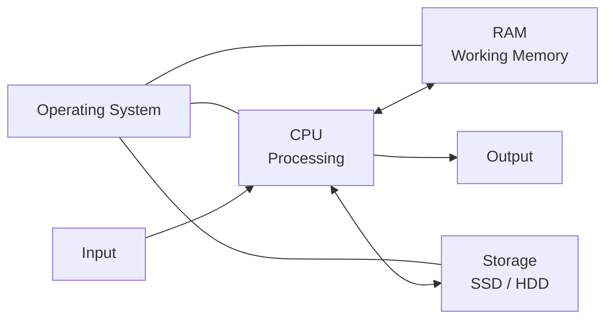
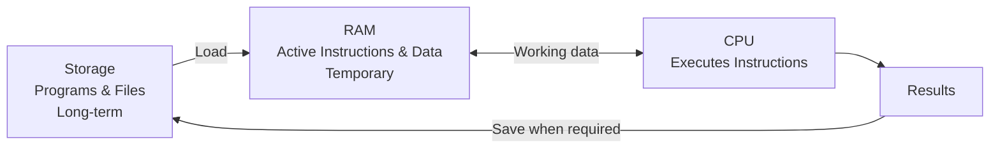
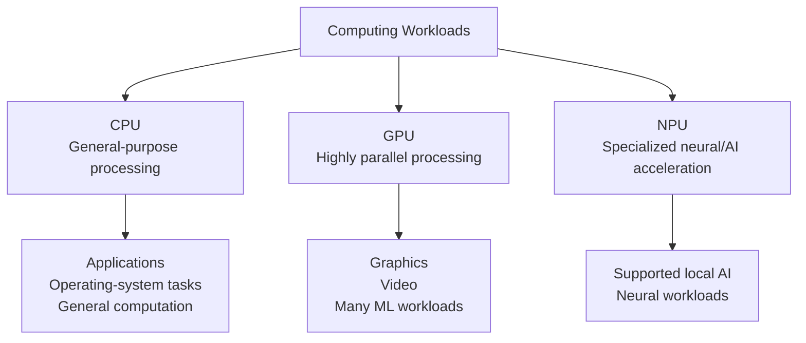
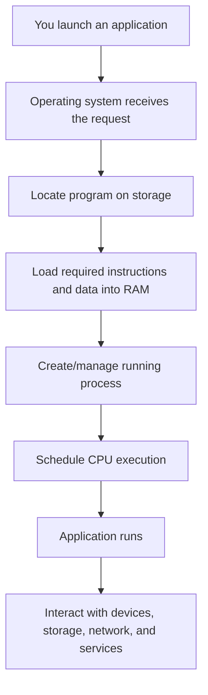
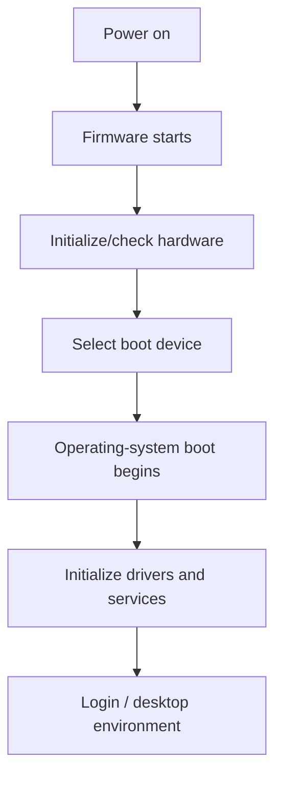

# How Computers Work

**Level:** Starter

**Tutorial:** T01

**Prerequisites:** [T00 — How to Start Learning Tech](../start-here/t00-how-to-start-learning-tech.md)

**Practice:** [GitHub companion](https://github.com/nelsondsouza/learn-with-nelson/tree/main/foundations/t01-how-computers-work)

---

Every time you open a browser, run Excel, execute Python, watch a video, query a database, or ask an AI assistant a question, a computer is doing an enormous amount of work underneath.

But what is actually happening?

What does the CPU do?

Why do computers need RAM if they already have storage?

What is the difference between an SSD and memory?

Why do AI systems use GPUs?

And what exactly happens between clicking an application and seeing it appear on your screen?

You do not need to become a computer engineer to answer these questions.

You need a useful mental model.

That's what we'll build in T01.

---

## 1. What You'll Learn

By the end of this tutorial, you'll be able to explain:

* input, processing, storage, and output
* what a CPU does
* what CPU cores mean
* what clock speed tells you—and what it doesn't
* what RAM is
* why running applications need memory
* RAM vs storage
* HDD vs SSD
* bits and bytes
* KB, MB, GB, and TB
* input and output devices
* the motherboard's basic role
* what a GPU does
* what an NPU is
* CPU vs GPU vs NPU
* how the operating system fits between applications and hardware
* program vs process
* what happens when you open an application
* what happens when a computer starts
* 32-bit vs 64-bit at a beginner level
* personal computers vs servers
* virtual machines and containers at recognition level
* why Developers, Data Analysts, and ML Engineers may need different hardware

You will also inspect your **own computer**.

The objective isn't to memorize hardware specifications.

It's to understand what the major components do and how they work together.

---

## 2. Before You Start

### Required

You need:

* a computer or laptop
* a modern web browser
* permission to view your computer's system information

### Software installation

**None.**

You don't need to install a hardware-monitoring application.

We'll use information already available through your operating system.

### Prerequisite

You should complete:

[T00 — How to Start Learning Tech](../start-here/t00-how-to-start-learning-tech.md)

T00 introduced hardware, software, operating systems, files, programming, databases, APIs, cloud computing, and AI.

Now we're going one layer deeper.

### GitHub companion

Exercises, example solutions, resources, and Mermaid diagram sources are available in the:

[T01 GitHub companion](https://github.com/nelsondsouza/learn-with-nelson/tree/main/foundations/t01-how-computers-work)

---

## 3. Understand It

### Start with four ideas

A useful first model of a computer is:

**Input → Processing → Output**

with **memory and storage** supporting the work.



This is deliberately simplified.

A real computer contains many additional components and layers, but this model gives us somewhere useful to start.

Consider a few everyday examples.

### Typing

You press a key.

```text
Keyboard
   ↓
Input
   ↓
Processing
   ↓
Character appears
   ↓
Output
```

### Opening a photograph

You select a photograph stored on your computer.

```text
Storage
   ↓
Photo data is read
   ↓
Processing
   ↓
Image displayed
   ↓
Output
```

### Running a program

```text
Program stored on SSD
        ↓
Required instructions/data loaded into RAM
        ↓
CPU executes instructions
        ↓
Program produces results
```

We'll now examine the important pieces individually.

---

### Hardware and software

T00 introduced this distinction.

**Hardware** is the physical equipment.

Examples:

* CPU
* RAM
* SSD
* motherboard
* keyboard
* monitor

**Software** consists of programs and instructions.

Examples:

* Windows
* macOS
* Linux
* Chrome
* Excel
* VS Code
* Python programs

A useful beginner mental model remains:

> **Hardware provides the machinery. Software tells the machinery what work to perform.**

---

# CPU — The General-Purpose Processing Engine

CPU stands for:

**Central Processing Unit**

The CPU executes instructions and performs much of a computer's general-purpose processing.

For now, remember:

> **CPU = general-purpose processing engine**

Suppose a program needs to:

* compare two numbers
* calculate a result
* move information
* make a decision
* repeat an operation

The CPU can execute the instructions needed to perform that work.

---

### A simplified instruction cycle

Conceptually, a processor repeatedly does something like:

```text
Get instruction
      ↓
Understand instruction
      ↓
Perform operation
      ↓
Continue
```

You may later encounter the terms:

**fetch → decode → execute**

That's a useful model, but modern processors are considerably more sophisticated than a simple one-instruction-at-a-time machine.

At this stage, understanding the purpose is more important than processor architecture.

---

# CPU Cores

Modern CPUs commonly contain multiple **cores**.

You can think of a core as an independent processing unit within the CPU capable of executing instructions.

Suppose a CPU has:

```text
1 core
4 cores
8 cores
16 cores
```

More cores can allow more work to proceed concurrently when the software and workload can use them effectively.

But avoid this beginner mistake:

> 8 cores must always be twice as fast as 4 cores.

Not necessarily.

Performance depends on many factors, including:

* CPU architecture
* processor generation
* individual core performance
* workload
* software
* cooling
* power limits
* memory
* storage
* other system components

The correct mental model is:

> **More cores can provide more processing capacity for workloads that can use them.**

---

# Clock Speed

You'll frequently see processor specifications such as:

```text
3.2 GHz
4.0 GHz
5.0 GHz
```

GHz means **gigahertz**.

Clock speed relates to the rate at which a processor operates.

This can make beginners think:

```text
5 GHz CPU > 4 GHz CPU
```

That's not a safe comparison.

Two CPUs with different architectures can accomplish different amounts of useful work per clock cycle.

So:

> **Do not compare CPUs using GHz alone.**

Later, when we discuss choosing hardware, we'll consider the workload and the whole system.

---

# RAM — Your Computer's Working Memory

RAM stands for:

**Random Access Memory**

A useful beginner mental model is:

> **RAM = temporary working space**

Imagine your computer has:

```text
Storage
1 TB

RAM
16 GB
```

Why have only 16 GB of RAM if you already have 1 TB of storage?

Because they serve different purposes.

When you're actively using programs, the computer needs fast access to the instructions and data those programs are working with.

That's where RAM comes in.

---

### Imagine a desk

Here's a useful analogy.

Think of:

**Storage = filing cabinet**

**RAM = desk**

The filing cabinet may contain hundreds of folders.

But when you're actively working, you take the files you need and put them on your desk.

A larger desk lets you keep more working material accessible at once.

Similarly, if you simultaneously run:

* Chrome with many tabs
* Excel
* Power BI
* VS Code
* Teams
* Python
* other applications

they all require memory.

This analogy isn't technically perfect, but it's useful for understanding the basic difference.

---

# RAM Is Usually Temporary

RAM is normally **volatile**.

That means its contents do not persist when power is removed.

If you are editing a document but haven't saved it, the working information may exist in memory.

Saving the document writes persistent information to storage.

This is one reason:

**Save your work**

has been good computing advice for decades.

---

# Storage — Keeping Information

Storage is designed to retain information long-term.

Examples include:

* operating-system files
* applications
* documents
* photographs
* videos
* source code
* databases
* datasets

Unlike normal RAM, storage keeps its information when the computer is switched off.

Two storage technologies you'll frequently encounter are HDDs and SSDs.

---

# HDD — Hard Disk Drive

A traditional hard disk drive stores data magnetically.

It contains mechanical components, including rotating platters.

HDDs can provide large amounts of storage relatively economically.

You'll still encounter them in:

* older computers
* desktops
* servers
* backup systems
* storage systems

---

# SSD — Solid-State Drive

SSD stands for:

**Solid-State Drive**

SSDs use flash-memory technology and don't have the spinning disks found in HDDs.

SSDs generally provide much faster data access than traditional HDDs.

That can noticeably improve operations such as:

* starting the computer
* opening applications
* loading files
* installing software
* reading project data

For most modern personal computers, an SSD is highly desirable as the primary drive.

---

# RAM vs Storage

This distinction is important enough to summarize.

| RAM                              | Storage                            |
| -------------------------------- | ---------------------------------- |
| Temporary working memory         | Long-term data storage             |
| Used heavily by running programs | Holds files and installed programs |
| Normally volatile                | Non-volatile                       |
| Typically smaller capacity       | Typically larger capacity          |
| Very fast                        | Slower than RAM                    |

Here's another view:



This relationship will become extremely important later.

When we learn:

* Python
* databases
* data analysis
* machine learning
* Docker
* cloud computing
* performance optimization

you'll repeatedly encounter CPU, memory, and storage considerations.

---

# Bits and Bytes

Computers represent information digitally.

At the lowest level, you'll frequently hear about:

**bits** and **bytes**.

A **bit** is a binary digit:

```text
0
```

or:

```text
1
```

A **byte** commonly consists of:

```text
8 bits
```

For example:

```text
01000001
```

is eight bits.

You don't need to learn binary arithmetic yet.

Just remember:

> **Bit = binary digit**

> **Byte = commonly 8 bits**

---

# KB, MB, GB and TB

You'll frequently see storage and file sizes described using:

```text
B
KB
MB
GB
TB
```

For a beginner approximation:

```text
~1,000 bytes = 1 KB
~1,000 KB    = 1 MB
~1,000 MB    = 1 GB
~1,000 GB    = 1 TB
```

This is deliberately simplified.

Later you'll encounter distinctions between decimal units such as:

```text
KB
MB
GB
```

and binary units such as:

```text
KiB
MiB
GiB
```

We don't need that distinction yet.

---

# Input Devices

Computers need ways to receive information.

Examples of input devices include:

* keyboard
* mouse
* microphone
* camera
* scanner
* touchscreen
* sensors

When you press a keyboard key, you're providing input.

When you speak into a microphone, you're providing input.

When a camera captures an image, it's providing input.

---

# Output Devices

Computers also need ways to communicate results.

Examples include:

* monitor
* speakers
* printer

A monitor displays visual output.

Speakers produce audio output.

A printer produces physical output.

Some devices perform both roles.

A touchscreen:

```text
Displays information → Output

Receives your touch → Input
```

---

# Motherboard

Open a desktop computer and you'll find that components need a way to connect and communicate.

The **motherboard** is the main circuit board connecting major hardware components.

Depending on the system, these may connect directly or indirectly through it:

* CPU
* RAM
* storage
* GPU
* networking hardware
* USB devices

For T01, remember:

> **Motherboard = major hardware connection platform**

You don't need to learn:

* CPU sockets
* chipsets
* PCIe lanes
* memory channels
* buses
* electrical design

yet.

---

# GPU — Graphics Processing Unit

GPU stands for:

**Graphics Processing Unit**

GPUs became widely associated with computer graphics.

Modern GPUs are also extremely useful for workloads involving large amounts of parallel computation.

That includes areas such as:

* graphics
* video processing
* scientific computing
* machine learning
* deep learning
* generative AI

A useful beginner distinction is:

> **CPU = flexible general-purpose processing**

> **GPU = highly parallel processing for suitable workloads**

Notice the phrase:

**suitable workloads**

A GPU isn't simply a CPU that's always faster.

Different processing architectures are suited to different kinds of work.

---

# Why AI Uses GPUs

Many machine-learning operations involve performing very large numbers of mathematical calculations that can be processed in parallel.

GPUs are well suited to many of these operations.

That's one reason you've heard so much about GPUs during the AI boom.

But there's an important beginner point:

> **You don't need a powerful GPU to start learning AI or machine learning.**

You can:

* learn fundamentals on ordinary hardware
* use small models
* use cloud environments
* use hosted notebooks
* use remote compute when required

Don't turn expensive hardware into a prerequisite for learning.

---

# NPU — Neural Processing Unit

You may increasingly see computers advertised as having an:

**NPU**

or:

**Neural Processing Unit**

An NPU is specialized hardware designed to accelerate certain neural-network and AI workloads efficiently.

At this stage, recognize the three categories:



Do **not** conclude:

```text
CPU = old
GPU = better
NPU = best
```

That's incorrect.

They're designed for different kinds of work.

---

# Where Does the Operating System Fit?

We introduced operating systems in T00.

Examples include:

* Windows
* macOS
* Linux

The operating system sits between much of the software you use and the underlying hardware.

It performs many responsibilities.

For example:

```text
Applications
     ↓
Operating System
     ↓
Hardware
```

Among other things, operating systems manage:

* processes
* memory
* files
* devices
* users
* permissions
* networking

When Chrome wants memory, it doesn't normally take control of physical RAM directly.

The operating system manages resources and provides mechanisms applications use.

We'll learn much more about this later.

---

# Program vs Process

This distinction will become important once we start programming.

A **program** is stored software containing instructions.

A **process** is a running instance of a program.

For example:

You install Chrome.

The Chrome software exists on storage.

That's a program.

You start Chrome.

The operating system creates and manages running processes associated with Chrome.

So:

```text
Program
Stored instructions

Process
Running instance
```

One program can also have multiple processes.

---

# What Happens When You Open an Application?

Suppose you click VS Code.

It feels simple:

```text
Click
 ↓
VS Code appears
```

Underneath, much more is happening.

Here's our beginner model:



Let's translate that.

### Step 1

You request that the application starts.

### Step 2

The operating system locates the program.

### Step 3

Required program instructions and data are loaded into memory.

### Step 4

The operating system manages the running process.

### Step 5

CPU time is scheduled.

### Step 6

The CPU executes instructions.

### Step 7

The application interacts with whatever resources it needs.

That might include:

* RAM
* storage
* display
* keyboard
* mouse
* network
* GPU
* other processes

The real sequence is much more sophisticated and many things may happen concurrently.

But this mental model is enough to understand what we're doing later when we say:

> "Run the program."

---

# What Happens When Your Computer Starts?

When you press the power button, Windows doesn't magically appear.

There's a startup process.

At a high level:



You'll eventually encounter terms such as:

* BIOS
* UEFI
* bootloader
* kernel
* drivers
* services

You don't need to memorize them today.

The important idea is:

> **The operating system itself must be loaded and initialized before you can use it normally.**

---

# 32-bit vs 64-bit

When downloading software, you may see options such as:

```text
32-bit
64-bit
x64
ARM64
```

These terms relate to processor architectures and software environments.

For our beginner level, know that most modern general-purpose computers use 64-bit environments.

64-bit systems can support much larger address spaces than 32-bit systems.

The practical lesson for now is:

> **When a download asks you to choose an architecture, check your system rather than guessing.**

We'll show you how when it matters.

---

# Personal Computer vs Server

You may imagine a server as an enormous machine in a data center.

Sometimes it is.

But the more useful definition is based on **what it does**.

A server is a computer or software system that provides resources or services to other systems.

Examples:

```text
Web server
Database server
File server
Email server
```

Your laptop is primarily configured for interactive personal use.

Servers are commonly optimized around requirements such as:

* reliability
* networking
* remote access
* scalability
* continuous operation
* specialized workloads

The underlying computing principles are still related.

A server also has things like:

* processors
* memory
* storage
* networking
* an operating environment

---

# Virtual Machines

You'll hear the term:

**Virtual Machine**, often shortened to **VM**.

A virtual machine provides a software-defined computer environment that behaves like a separate machine.

For example:

```text
Physical Computer
      ↓
Virtualization
      ↓
Virtual Machine A
Virtual Machine B
Virtual Machine C
```

Each VM can typically run its own operating system.

We'll learn virtualization properly when we reach cloud and infrastructure topics.

For now, recognition is enough.

---

# Containers

You'll also hear:

**container**

especially when we eventually learn Docker.

A container packages an application and its dependencies into an isolated environment while sharing the host operating-system kernel.

At this point, don't try to master:

```text
VM vs container
```

Just recognize that they're different approaches to creating isolated computing environments.

We'll revisit them when you have enough background for the distinction to be useful.

---

# Different Careers, Different Hardware Needs

Now let's connect this to the careers introduced in T00.

## Developer

A Developer commonly benefits from:

* responsive CPU
* sufficient RAM
* fast SSD
* enough storage

Development work may involve running:

```text
VS Code
Browser
Git
Local database
Development server
Docker containers
Virtual machines
Build tools
```

Not necessarily all at once—but development environments can become resource-intensive.

---

## Data Analyst

A Data Analyst may use:

```text
Excel
SQL tools
Power BI
Python
Jupyter
Databases
Large datasets
```

RAM can become especially important as datasets grow.

Storage speed can also affect loading and processing data.

A capable CPU helps analytical workloads.

Software compatibility matters too.

For example, some professional tools have operating-system-specific requirements.

---

## ML Engineer

An ML Engineer may eventually work with:

```text
Python
Large datasets
Machine-learning libraries
Deep-learning frameworks
Models
Containers
MLOps tools
```

Depending on the work, hardware requirements can include:

* substantial RAM
* fast storage
* capable CPUs
* GPUs

But remember:

**Cloud computing changes the equation.**

Your laptop doesn't need to contain every resource you'll ever use.

You can run powerful workloads on remote infrastructure.

---

# Do You Need a Powerful Computer to Learn Tech?

No.

This deserves its own section because hardware specifications can become another form of beginner procrastination.

You do not need to buy:

* a workstation
* a gaming PC
* a high-end GPU
* an AI PC
* a server

before learning.

Start with the computer you already have if it can reasonably run the tools required for your chosen path.

When we reach a tutorial that genuinely needs more computing resources, we'll explain the options.

---

## 4. Follow Along

Now let's inspect the computer you're actually using.

Don't install anything.

---

### Windows

Open:

**Settings → System → About**

Look for:

* processor
* installed RAM
* system type
* Windows edition

Write them down.

Then open:

**Task Manager**

Select:

**Performance**

You'll normally see sections such as:

```text
CPU
Memory
Disk
Wi-Fi / Ethernet
GPU
```

Click each one.

Don't worry about understanding every number.

Our goal is recognition.

---

### macOS

Open:

**Apple menu → About This Mac**

Review the information shown.

You can also use:

**System Settings → General → About**

For additional technical information, macOS provides:

**System Information**

Look for:

* chip/processor
* memory
* storage
* graphics

---

### Linux

Linux distributions vary.

Your desktop environment may provide a graphical system-information application.

If you're already comfortable using a terminal, you might encounter commands such as:

```bash
lscpu
```

```bash
free -h
```

```bash
lsblk
```

But don't worry if you've never used these.

We'll learn command-line fundamentals properly in T03.

---

### Record your machine

Create a simple note:

```text
Operating system:
Version:
Processor:
CPU cores:
Installed RAM:
Storage capacity:
Storage type:
GPU:
System architecture/type:
```

If you can't find something, write:

```text
Not found yet
```

That's better than guessing.

The complete version of this exercise is available in:

[Identify Your Computer — GitHub](https://github.com/nelsondsouza/learn-with-nelson/blob/main/foundations/t01-how-computers-work/exercises/identify-your-computer.md)

---

### Watch RAM change

Now open a few applications you normally use.

For example:

```text
Browser
Excel
VS Code
```

Look at memory usage.

Open additional browser tabs.

Look again.

Close a large application.

Look again.

You have just observed something important:

> **Running software consumes working memory dynamically.**

Closing the program can free memory.

But the installed program and your saved files remain on storage.

That's RAM vs storage in practice.

---

## 5. Try It Yourself

Before looking at the solution, answer these.

### Exercise 1

Match each description:

**CPU / RAM / SSD or HDD / GPU / motherboard / operating system**

A. Temporary working memory for running programs.

B. Executes general-purpose instructions.

C. Keeps files when power is removed.

D. Connects major hardware components.

E. Especially useful for suitable highly parallel workloads.

F. Manages processes, memory, files, devices, and other resources.

---

### Exercise 2

RAM or Storage?

**1.** Holds saved photographs long-term.

**2.** Provides working space for running applications.

**3.** Normally loses its contents when power is removed.

**4.** Holds installed applications.

**5.** Opening many applications can increase usage of this resource.

---

### Exercise 3

Program or Process?

**1.** Chrome installed on your computer.

**2.** A currently running Chrome instance.

**3.** Something the operating system schedules CPU time for.

**4.** Software stored before being launched.

---

### Exercise 4

Put these in simplified order:

```text
CPU executes instructions.

You launch the application.

Operating system locates the program.

Required instructions/data load into RAM.

Application becomes usable.
```

The complete exercise and example answers are in the [T01 GitHub companion](https://github.com/nelsondsouza/learn-with-nelson/tree/main/foundations/t01-how-computers-work).

Try first.

Then check the solution.

---

## 6. Common Mistakes

### Mistake 1 — RAM and storage are the same thing

They're not.

Remember:

**RAM = temporary working space**

**Storage = long-term information**

---

### Mistake 2 — More GHz always means a faster CPU

Clock speed alone isn't enough to compare processors.

Architecture, cores, generation, workload and other factors matter.

---

### Mistake 3 — More cores always means proportionally more speed

Software must be able to use the available processing resources effectively.

Some workloads benefit greatly.

Others don't.

---

### Mistake 4 — GPU means gaming

GPUs are important for graphics, but they're also widely used in:

* scientific computing
* machine learning
* deep learning
* AI

---

### Mistake 5 — GPU is always faster than CPU

Different processors are designed for different workloads.

"Faster" without specifying the task isn't very meaningful.

---

### Mistake 6 — You need an AI PC to learn AI

You don't.

Your learning can begin with ordinary hardware.

Remote and cloud resources are available when workloads require them.

---

### Mistake 7 — Buying a computer based on one specification

For example:

```text
5 GHz!
```

or:

```text
32 GB RAM!
```

or:

```text
1 TB!
```

A computer is a system.

Evaluate:

* CPU
* RAM
* storage
* GPU where relevant
* operating system
* software compatibility
* workload
* budget
* upgradeability
* portability/battery requirements

together.

---

## 7. Use AI

AI can help you understand your computer specifications—but don't simply ask:

> Is my computer good?

That's too vague.

Instead, give AI context.

For example:

```text
I am learning to become a Data Analyst.

I expect to use:
- Excel
- SQL
- Power BI
- Python
- VS Code

My computer has:
- [CPU]
- [RAM]
- [storage]
- [GPU if known]

Explain which components matter most for these workloads.

For each component:
1. explain what it does,
2. explain why it matters for my workload,
3. identify likely limitations,
4. distinguish facts from assumptions.

Do not recommend buying anything yet.
```

Notice what we're doing.

We're asking AI to help us **understand**, not immediately to shop.

---

### Use AI to test yourself

Try:

```text
I am learning how computers work.

Quiz me on:
- CPU
- RAM
- storage
- GPU
- operating systems
- programs
- processes

Ask one question at a time.

Do not reveal the answer until I respond.

If my answer is wrong, explain why using beginner-friendly language.
```

This is a much better use of AI than:

> Summarize everything so I don't have to learn it.

Keep using our rule:

**Ask → Understand → Verify → Apply**

---

## 8. Mini Challenge

You're comparing two hypothetical computers.

### Computer A

```text
Higher advertised CPU clock speed
8 GB RAM
1 TB HDD
```

### Computer B

```text
Slightly lower advertised CPU clock speed
16 GB RAM
512 GB SSD
```

You want to learn:

* programming
* VS Code
* Git
* web development
* SQL
* beginner data analysis

Which computer would you **investigate first**?

Notice the wording.

Not:

> Which one is definitely better?

There isn't enough information to make that conclusion.

Explain:

1. how RAM affects your thinking;
2. how HDD vs SSD affects your thinking;
3. why storage capacity matters;
4. why the CPU descriptions aren't enough;
5. what additional information you'd want before buying.

Write your reasoning before checking the example answer:

[Computer Components — Example Solution](https://github.com/nelsondsouza/learn-with-nelson/blob/main/foundations/t01-how-computers-work/solutions/computer-components-example.md)

---

## 9. Cheat Sheet

| Term             | Beginner meaning                                                                          |
| ---------------- | ----------------------------------------------------------------------------------------- |
| CPU              | General-purpose processor that executes instructions                                      |
| CPU Core         | Processing unit within a CPU capable of executing work                                    |
| Clock Speed      | One characteristic of processor operation, commonly measured in GHz                       |
| RAM              | Temporary working memory used by running software                                         |
| Storage          | Persistent place for programs and files                                                   |
| HDD              | Magnetic storage using mechanical components                                              |
| SSD              | Solid-state storage using flash memory                                                    |
| Bit              | Binary digit: 0 or 1                                                                      |
| Byte             | Commonly eight bits                                                                       |
| KB               | Kilobyte                                                                                  |
| MB               | Megabyte                                                                                  |
| GB               | Gigabyte                                                                                  |
| TB               | Terabyte                                                                                  |
| Input            | Information supplied to a computer                                                        |
| Output           | Information produced by a computer                                                        |
| Motherboard      | Main circuit board connecting major hardware components                                   |
| GPU              | Processor optimized for highly parallel workloads such as graphics and many ML operations |
| NPU              | Specialized processor for certain neural/AI workloads                                     |
| Operating System | Software that manages hardware/resources and supports applications                        |
| Program          | Stored set of software instructions                                                       |
| Process          | Running instance of a program                                                             |
| Server           | Computer or software system providing services/resources to other systems                 |
| Virtual Machine  | Software-defined machine environment, typically with its own OS                           |
| Container        | Isolated application environment sharing the host OS kernel                               |

You don't need to memorize this table.

Return to it when terminology becomes confusing.

---

## 10. What You Now Know

You started T01 with a computer.

Now you should have a mental model of what's happening inside it.

You understand that:

* computers receive input;
* CPUs perform general-purpose processing;
* RAM provides temporary working space;
* storage keeps information persistently;
* SSDs and HDDs are storage technologies;
* bits and bytes represent digital information;
* input and output connect computers with users and environments;
* motherboards connect major components;
* GPUs handle suitable parallel workloads efficiently;
* NPUs accelerate certain AI workloads;
* operating systems coordinate hardware and software resources;
* programs are stored software;
* processes are running instances;
* launching an application involves storage, memory, the operating system and CPU;
* computers go through a boot process before the OS becomes usable;
* servers use the same broad computing principles;
* virtual machines and containers create different forms of isolated computing environments;
* hardware requirements depend on the work being performed.

Most importantly, terms like:

```text
CPU
RAM
SSD
GPU
64-bit
process
server
```

should now feel less mysterious.

That's exactly what we wanted.

---

## 11. Next Tutorial

# T02 — Files, Folders & Paths

You've learned what the major computer components do.

Now we need to understand **how information is organized**.

In T02, we'll cover:

* files
* folders/directories
* filenames
* file extensions
* absolute paths
* relative paths
* root directories
* parent and child directories
* Windows paths
* macOS/Linux paths
* hidden files
* common file types
* why developers care about directory structure
* why paths frequently cause beginner errors

This will prepare you for T03:

**Command Line from Zero**

because commands make much more sense once you understand where files actually live.

### Before continuing

Complete both T01 exercises:

[Identify Your Computer](https://github.com/nelsondsouza/learn-with-nelson/blob/main/foundations/t01-how-computers-work/exercises/identify-your-computer.md)

[Computer Components](https://github.com/nelsondsouza/learn-with-nelson/blob/main/foundations/t01-how-computers-work/exercises/computer-components.md)

Then compare your work with the example solution.

[Open the T01 GitHub companion](https://github.com/nelsondsouza/learn-with-nelson/tree/main/foundations/t01-how-computers-work){ .md-button }

**Next: T02 — Files, Folders & Paths**
