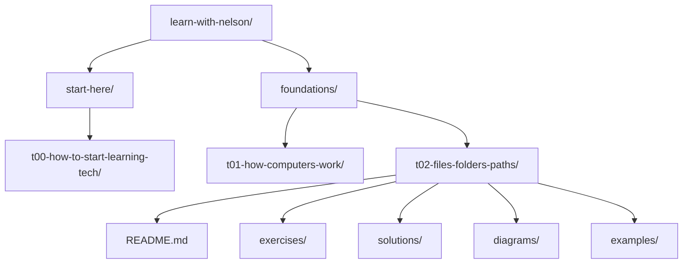
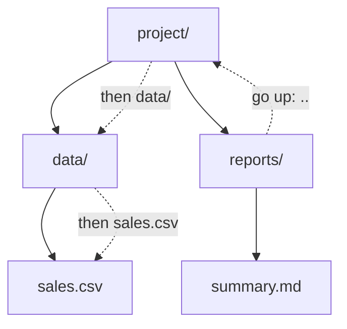

# Files, Folders & Paths

**Level:** Starter
**Tutorial:** T02
**Prerequisites:** [T00 — How to Start Learning Tech](../start-here/t00-how-to-start-learning-tech.md) · [T01 — How Computers Work](t01-how-computers-work.md)
**Practice:** [GitHub companion](https://github.com/nelsondsouza/learn-with-nelson/tree/main/foundations/t02-files-folders-paths)

Every file on your computer lives somewhere.

Your photographs.

Your documents.

Your Python programs.

Your Excel workbooks.

Your datasets.

Your Git repositories.

Even the applications installed on your computer consist of files organized in locations the operating system understands.

Soon, we'll start using the command line, VS Code, Git, Python, SQL and other development tools.

And one beginner problem appears again and again:

> **"It says the file doesn't exist—but I can see it!"**

Very often, the problem isn't the file.

It's the **path**.

Before learning commands, let's understand how computers organize and locate information.

---

## 1. What You'll Learn

By the end of T02, you'll be able to explain and use:

* files
* folders and directories
* filenames
* file extensions
* common file types
* folder hierarchies
* parent and child directories
* root directories
* home/user directories
* current directories
* paths
* absolute paths
* relative paths
* Windows paths
* macOS/Linux paths
* path separators
* `.` and `..`
* hidden files and folders
* case sensitivity
* sensible file naming
* basic project directory structures
* common reasons paths fail

You'll also create your own safe practice folder structure and reason about paths without relying on memorization.

---

## 2. Before You Start

### Required

You need:

* a computer
* access to your normal file manager
* permission to create a few practice folders and files

On Windows, you'll normally use **File Explorer**.

On macOS, you'll normally use **Finder**.

Linux desktop environments provide file managers such as Files, Dolphin, Nemo and others.

### Software installation

**None.**

Don't install a special file-management application for this tutorial.

### Prerequisites

Complete:

[T00 — How to Start Learning Tech](../start-here/t00-how-to-start-learning-tech.md)

[T01 — How Computers Work](t01-how-computers-work.md)

T01 explained storage and how applications use files.

Now we're going to understand how those files are **organized and located**.

### GitHub companion

Exercises, example solutions, practice files and Mermaid diagram sources are available here:

[T02 GitHub companion](https://github.com/nelsondsouza/learn-with-nelson/tree/main/foundations/t02-files-folders-paths)

---

## 3. Understand It

# Start with a File

A **file** stores information.

You're already familiar with files such as:

```text
report.pdf
sales.xlsx
photo.jpg
notes.txt
presentation.pptx
```

As we move into technical work, you'll encounter many more:

```text
README.md
app.py
index.html
styles.css
data.csv
query.sql
config.yaml
package.json
```

Different files contain different kinds of information.

A photograph contains image data.

A spreadsheet contains workbook data.

A Python source file contains Python code.

A Markdown file contains text written using Markdown syntax.

---

# What Is a Folder?

A **folder** organizes files and other folders.

For example:

```text
Documents/
├── Work/
├── Personal/
└── Learning/
```

Folders help us group related information.

A folder can contain:

* files
* other folders
* both

---

# Folder vs Directory

In everyday graphical interfaces, you'll usually hear:

**folder**

In programming, operating systems, terminals and technical documentation, you'll frequently hear:

**directory**

For our purposes:

> **Folder ≈ Directory**

There are technical nuances in some contexts, but beginners can treat these terms as equivalent for now.

When T03 asks you to:

> Change directory

it essentially means:

> Move to another folder location in the terminal.

---

# Files Form a Hierarchy

Folders can contain folders, which can contain more folders.

This creates a **hierarchy**.

Consider our Learn with Nelson repository:

```text
learn-with-nelson/
├── start-here/
│   └── t00-how-to-start-learning-tech/
└── foundations/
    ├── t01-how-computers-work/
    └── t02-files-folders-paths/
        ├── README.md
        ├── exercises/
        ├── solutions/
        ├── diagrams/
        └── examples/
```

Visually:



You will see structures like this constantly in technology.

---

# Parent and Child

Suppose we have:

```text
project/
└── data/
    └── sales.csv
```

`project` contains `data`.

Therefore:

```text
project
   ↓
 parent of data
```

`data` is a **child** of `project`.

Similarly:

```text
data
   ↓
 parent of sales.csv
```

The terminology becomes useful when navigating directories.

---

# Siblings

Consider:

```text
project/
├── data/
├── docs/
└── src/
```

`data`, `docs` and `src` have the same parent.

We can think of them as **siblings** in the directory hierarchy.

You won't constantly use the word "sibling" in commands, but the tree mental model is useful.

---

# Filenames

A file needs a name.

Examples:

```text
report
photo
sales
README
analysis
```

But many filenames also contain something else:

```text
report.pdf
photo.jpg
sales.csv
README.md
analysis.py
```

The part after the final dot is commonly called the **file extension**.

---

# File Extensions

Consider:

```text
report.pdf
```

We can think of it as:

```text
report  +  .pdf
```

where:

**report** = base filename

**.pdf** = extension

The extension commonly helps software and operating systems identify the expected type or format of the file.

---

# Common File Extensions

You'll encounter many of these throughout the tutorial series.

| Extension        | Common use                       |
| ---------------- | -------------------------------- |
| `.txt`           | Plain text                       |
| `.md`            | Markdown                         |
| `.pdf`           | PDF document                     |
| `.docx`          | Microsoft Word document          |
| `.xlsx`          | Microsoft Excel workbook         |
| `.csv`           | Delimited text data              |
| `.jpg` / `.jpeg` | JPEG image                       |
| `.png`           | PNG image                        |
| `.html`          | HTML document                    |
| `.css`           | Stylesheet                       |
| `.js`            | JavaScript source                |
| `.py`            | Python source                    |
| `.sql`           | SQL source/query                 |
| `.json`          | Structured text data             |
| `.yaml` / `.yml` | Configuration or structured data |

Don't try to memorize the entire table.

You'll naturally learn these extensions by using them.

---

# An Extension Is Not a Conversion Tool

Suppose you have:

```text
photo.jpg
```

and rename it:

```text
photo.png
```

Did you convert the JPEG image into PNG?

**No.**

You changed the filename.

You did not necessarily change the underlying file format.

Similarly:

```text
report.txt
```

renamed to:

```text
report.pdf
```

doesn't magically become a valid PDF document.

Applications designed to convert formats actually interpret one format and produce another.

This distinction will save you confusion later.

---

# Hidden File Extensions

Some operating systems or file-manager configurations hide known extensions.

You might see:

```text
report
```

while the actual filename is:

```text
report.docx
```

This can create beginner mistakes.

For example, someone tries to create:

```text
app.py
```

but accidentally creates:

```text
app.py.txt
```

Their file manager displays:

```text
app.py
```

because `.txt` is hidden.

Later Python doesn't behave as expected.

When working with development files, it's useful to know whether your file manager is showing extensions.

---

# What Is a Path?

Now we reach the central concept of T02.

A **path** describes a location in a file system.

Imagine telling someone:

> My file is called `sales.csv`.

That tells them the name.

But where is it?

Perhaps:

```text
Documents
   ↓
Projects
   ↓
Sales
   ↓
data
   ↓
sales.csv
```

A path represents that location.


---

# Windows Paths

A Windows path may look like:

```text
C:\Users\Nelson\Documents\project\data\sales.csv
```

Notice:

```text
C:
```

and the separators:

```text
\
```

The backslash is commonly used as the Windows directory separator.

You may have other drives:

```text
D:\
E:\
```

depending on your computer.

Don't assume every Windows machine uses the same drives or folder structure.

---

# macOS Paths

A macOS path might look like:

```text
/Users/nelson/Documents/project/data/sales.csv
```

Notice the separator:

```text
/
```

macOS uses Unix-style path conventions.

---

# Linux Paths

A Linux user path might look like:

```text
/home/nelson/project/data/sales.csv
```

Again, directories are separated using:

```text
/
```

Exact paths depend on the Linux distribution, configuration and user.

---

# Don't Memorize Someone Else's Path

You may see a tutorial say:

```text
C:\Users\John\Documents\project
```

and copy it exactly.

But your computer may have:

```text
C:\Users\Nelson\Documents\project
```

The concept matters more than the literal path.

This becomes especially important when following coding tutorials.

---

# Absolute Paths

An **absolute path** identifies a location using a complete starting point.

Windows example:

```text
C:\Users\Nelson\Documents\project\data\sales.csv
```

macOS example:

```text
/Users/nelson/Documents/project/data/sales.csv
```

Linux example:

```text
/home/nelson/project/data/sales.csv
```

These identify locations beginning from a root or complete starting location.

---

# Relative Paths

A **relative path** describes a location relative to where you currently are.

Suppose our project is:

```text
project/
├── README.md
├── data/
│   └── sales.csv
└── reports/
    └── summary.md
```

If your current location is:

```text
project/
```

the path to the dataset can simply be:

```text
data/sales.csv
```

You don't need the entire absolute path.

---

# Why Relative Paths Matter

Imagine two people clone the same Git repository.

On your computer:

```text
C:\Users\Nelson\Projects\my-project
```

On someone else's:

```text
/Users/sam/code/my-project
```

If your program expects:

```text
C:\Users\Nelson\Projects\my-project\data\sales.csv
```

it will probably fail on Sam's machine.

But if both run the project from the same project structure and use:

```text
data/sales.csv
```

the relative relationship can remain valid.

This is one reason relative paths are so important in portable projects.

---

# Current Directory

You'll soon hear:

**current directory**

or:

**working directory**

This means the directory your terminal, program or tool is currently operating from.

Suppose your current directory is:

```text
project/
```

Then:

```text
data/sales.csv
```

is interpreted relative to `project/`.

Change the current directory, and the same relative path may refer to something different—or fail entirely.

This is one of the most common beginner causes of:

```text
File not found
```

---

# The Dot: `.`

In many command-line and path contexts:

```text
.
```

means:

**current directory**

For example:

```text
./data
```

means:

> the `data` directory inside the current directory.

You don't need to use this yet.

Just recognize it before T03.

---

# The Double Dot: `..`

In many path contexts:

```text
..
```

means:

**parent directory**

Consider:

```text
project/
├── data/
│   └── sales.csv
└── reports/
    └── summary.md
```

Suppose your current location is:

```text
reports/
```

To reach `sales.csv`, conceptually you need to:

```text
Go up to project/
        ↓
Enter data/
        ↓
sales.csv
```

The relative path is:

```text
../data/sales.csv
```

Here:

```text
..
```

means:

> go to the parent directory.

---

# Visualizing Relative Paths



So from:

```text
reports/
```

we can express:

```text
../data/sales.csv
```

Once this clicks, many terminal and programming examples become much easier.

---

# Root Directory

A file system has a top-level starting point.

On Unix-like systems, the root directory is represented by:

```text
/
```

You might see paths such as:

```text
/etc
/usr
/home
/var
```

all ultimately beneath `/`.

---

# Windows Drive Roots

Windows commonly uses drive-based roots.

For example:

```text
C:\
```

A path might begin:

```text
C:\Users
```

Another drive might be:

```text
D:\
```

There are more details to Windows path handling, but this mental model is sufficient for now.

---

# Home Directory

Operating systems normally provide each user with a personal location.

You'll frequently hear:

**home directory**

or:

**user directory**

Common patterns include:

### Windows

```text
C:\Users\<username>
```

### macOS

```text
/Users/<username>
```

### Linux

```text
/home/<username>
```

Your exact setup can differ.

---

# Hidden Files and Folders

Not every file is displayed by default.

Some files and folders are **hidden**.

Later you'll encounter names such as:

```text
.git
.gitignore
.env
```

On Unix-like systems, filenames beginning with:

```text
.
```

are conventionally hidden from normal directory listings.

Windows also supports hidden-file attributes.

---

# Why Hide Files?

Hidden files are often used for:

* configuration
* application settings
* metadata
* system information
* development tooling

Hidden doesn't mean:

> unimportant.

And it definitely doesn't mean:

> safe to delete.

If you don't recognize a hidden file, investigate before changing it.

---

# Case Sensitivity

Consider:

```text
Report.csv
```

and:

```text
report.csv
```

Are they the same file?

The answer depends on the file system and configuration.

Some environments are case-sensitive.

Others commonly behave case-insensitively.

This means software that appears to work on one computer can fail elsewhere if filename capitalization is inconsistent.

A good habit is:

> **Use consistent capitalization and don't rely on case-insensitive behavior.**

---

# Spaces in Filenames

A filename can often contain spaces:

```text
Quarterly Sales Report.xlsx
```

That's perfectly reasonable for many documents.

But spaces can require special handling in command-line environments and scripts.

You'll learn this in T03.

For technical project files, you will often see naming styles such as:

```text
quarterly-sales-report.csv
```

or:

```text
quarterly_sales_report.csv
```

Different ecosystems have different conventions.

For now, consistency matters more than choosing one universal naming style.

---

# Avoid Confusing Names

Names such as:

```text
final.docx
final2.docx
final-new.docx
final-new-2.docx
final-actual.docx
final-final.docx
```

are a warning sign.

Clear naming and version control become increasingly important as projects grow.

We'll solve some of these problems later with Git.

---

# Why Paths Fail

You will eventually encounter errors such as:

```text
File not found
```

or:

```text
No such file or directory
```

or:

```text
The system cannot find the path specified
```

Don't panic.

Ask systematically:

### Does the file exist?

Check.

### Is the filename correct?

```text
sales.csv
```

isn't necessarily:

```text
Sales.csv
```

everywhere.

### Is the extension correct?

Perhaps the real file is:

```text
sales.csv.txt
```

### Are you in the expected directory?

Your relative path depends on your current location.

### Did the file move?

A path that worked yesterday can fail after reorganizing folders.

### Did you copy someone else's absolute path?

Their username and project location probably differ.

### Are permissions involved?

The file may exist but your user or process may not have permission to access it.

We'll learn how to diagnose these issues gradually.

---

# Why Project Structure Matters

Imagine a project containing 100 files all dumped into one folder.

```text
project/
├── photo1.png
├── data.csv
├── app.py
├── notes.txt
├── output.csv
├── test.py
├── report.pdf
├── screenshot.png
├── ...
```

It becomes difficult to understand.

A basic structure might instead be:

```text
project/
├── README.md
├── data/
├── docs/
├── src/
├── tests/
└── output/
```

Now the project communicates intent.

`data/` contains data.

`src/` contains source code.

`tests/` contains tests.

`docs/` contains documentation.

`output/` contains generated results.

This isn't a universal structure.

The correct structure depends on the project.

The principle is:

> **Organize files deliberately so humans and tools can understand the project.**

---

# Why Developers Care About Paths

Paths appear everywhere.

Python:

```python
data_file = "data/sales.csv"
```

HTML:

```html

```

Markdown:

```markdown
[Read the guide](docs/guide.md)
```

Git:

```text
.gitignore
```

Docker:

```text
./src
```

Configuration:

```text
config/settings.yaml
```

Data work:

```text
data/raw/customers.csv
```

If you understand paths, all of these become less mysterious.

---

## 4. Follow Along

Now create a safe practice area.

Don't use an important work folder.

---

# Step 1 — Create the Main Folder

Create:

```text
t02-practice
```

Use your normal file manager.

---

# Step 2 — Create Three Folders

Inside it, create:

```text
documents
data
images
```

You should now have:

```text
t02-practice/
├── documents/
├── data/
└── images/
```

---

# Step 3 — Create a Text File

Inside:

```text
documents/
```

create:

```text
notes.txt
```

Your structure should now be:

```text
t02-practice/
├── documents/
│   └── notes.txt
├── data/
└── images/
```

---

# Step 4 — Identify the Relationships

For:

```text
notes.txt
```

ask:

**What is its parent?**

Answer:

```text
documents/
```

What is the parent of `documents/`?

```text
t02-practice/
```

What are the siblings of `documents/`?

```text
data/
images/
```

You've just navigated a hierarchy conceptually.

---

# Step 5 — Check the Extension

Can you actually see:

```text
notes.txt
```

or does your file manager display:

```text
notes
```

If the extension is hidden, find your operating system's setting for displaying file extensions.

Don't randomly change existing files while experimenting.

---

# Step 6 — Find the Location

Use your file manager to determine where `notes.txt` lives.

On Windows, it might resemble:

```text
C:\Users\<username>\Documents\t02-practice\documents\notes.txt
```

On macOS:

```text
/Users/<username>/Documents/t02-practice/documents/notes.txt
```

On Linux:

```text
/home/<username>/Documents/t02-practice/documents/notes.txt
```

Your actual location may differ.

That's fine.

---

# Step 7 — Separate Name from Path

Suppose the absolute location is:

```text
C:\Users\Nelson\Documents\t02-practice\documents\notes.txt
```

The **filename** is:

```text
notes.txt
```

The **path** identifies where that file lives.

Don't confuse these two ideas.

---

# Step 8 — Think Relatively

If your current location were:

```text
t02-practice/
```

then the relative path would be:

```text
documents/notes.txt
```

If your current location were:

```text
data/
```

you would conceptually go:

```text
..
```

back to:

```text
t02-practice/
```

then enter:

```text
documents/
```

So the relative path becomes:

```text
../documents/notes.txt
```

You don't need to type this into a terminal yet.

Just understand the relationship.

---

## 5. Try It Yourself

Use this fictional project:

```text
project/
├── README.md
├── data/
│   ├── raw/
│   │   └── sales.csv
│   └── processed/
│       └── summary.csv
├── docs/
│   └── guide.md
└── src/
    └── app.py
```

### Exercise 1 — From `project/`

Write the relative path to:

1. `sales.csv`
2. `summary.csv`
3. `guide.md`
4. `app.py`

---

### Exercise 2 — From `docs/`

Write the relative path to:

1. `README.md`
2. `sales.csv`
3. `app.py`

---

### Exercise 3 — From `data/raw/`

Write the relative path to:

1. `summary.csv`
2. `README.md`
3. `guide.md`

---

### Exercise 4 — Explain It

In your own words:

1. What is an absolute path?
2. What is a relative path?
3. What does `.` represent?
4. What does `..` represent?
5. Why might an absolute path copied from another computer fail on yours?

Don't just memorize the answers.

Draw the directory tree if you get stuck.

The complete exercise is available here:

[Paths Practice — GitHub](https://github.com/nelsondsouza/learn-with-nelson/blob/main/foundations/t02-files-folders-paths/exercises/paths-practice.md)

---

## 6. Common Mistakes

### Mistake 1 — Confusing a filename with a path

```text
sales.csv
```

is a filename.

```text
data/raw/sales.csv
```

is a path to that filename from some location.

---

### Mistake 2 — Assuming relative paths work from everywhere

A relative path depends on the current location.

Change the current directory and the meaning may change.

---

### Mistake 3 — Copying someone else's absolute path

This:

```text
C:\Users\John\Documents\project
```

probably isn't your path.

Understand the structure instead of blindly copying it.

---

### Mistake 4 — Hiding extensions

You think you created:

```text
app.py
```

but actually created:

```text
app.py.txt
```

Displaying extensions can prevent this confusion.

---

### Mistake 5 — Renaming an extension to convert a file

Changing:

```text
data.xlsx
```

to:

```text
data.csv
```

doesn't perform a proper Excel-to-CSV conversion.

---

### Mistake 6 — Ignoring capitalization

A path that works in one environment can fail in another if your capitalization is inconsistent.

---

### Mistake 7 — Using unclear filenames

Avoid unnecessary ambiguity such as:

```text
file1
newfile
latest
final-final
test2
```

Prefer names that communicate purpose.

---

### Mistake 8 — Deleting hidden files you don't recognize

Hidden development and configuration files can be important.

Investigate first.

---

### Mistake 9 — Building enormous folder hierarchies

Organization is useful.

Over-organization isn't.

This:

```text
project/
└── files/
    └── current/
        └── new/
            └── important/
                └── latest/
                    └── data/
```

probably isn't helping.

Use the simplest structure that clearly organizes the work.

---

## 7. Use AI

AI can be very useful when a path is confusing.

But give it context.

Instead of:

> My file doesn't work.

try:

```text
I am learning file paths.

My project structure is:

project/
├── data/
│   └── sales.csv
├── reports/
│   └── summary.md
└── src/
    └── app.py

Assume my current directory is:

project/src/

I want to reach:

project/data/sales.csv

Explain the relative path step by step.

Do not just give me the answer.
Explain what each .. means.
```

That forces the AI to teach the reasoning.

---

### Ask AI to generate practice

Try:

```text
I am learning absolute and relative file paths.

Create a fictional project directory tree with:
- 4 top-level folders
- at least 3 nested levels
- 8 files

Then give me 10 relative-path exercises.

For each question, tell me:
1. my current directory,
2. the file I need to reach.

Do not show the answers until I ask.
```

That's an excellent use of AI as a tutor.

---

### Ask AI to diagnose a path error

Later, when code produces:

```text
File not found
```

you can provide:

```text
1. the error message
2. your current directory
3. your project tree
4. the path used by the program
5. your operating system
```

and ask:

```text
Help me diagnose why this path fails.

Do not rewrite my whole program.

Check the path reasoning first.
```

Again:

**Ask → Understand → Verify → Apply**

---

## 8. Mini Challenge

You're starting a beginner data-analysis project.

You have:

* a README
* two CSV datasets
* three screenshots
* one Python file
* project notes
* one final exported PDF report

Create a sensible project structure.

Requirements:

* keep original/source data separate from generated output
* keep code easy to find
* organize documentation and screenshots
* use understandable names
* don't create unnecessary folders

Write your answer as a tree:

```text
my-project/
├── ...
├── ...
└── ...
```

Then explain:

1. Where did you put the CSV files?
2. Where did you put the Python file?
3. Where did you put the screenshots?
4. Where did you put the final report?
5. Why?

There isn't one perfect structure.

The challenge is to make deliberate decisions.

After you've finished, compare your reasoning with:

[Project Structure — Example Solution](https://github.com/nelsondsouza/learn-with-nelson/blob/main/foundations/t02-files-folders-paths/solutions/project-structure-example.md)

---

## 9. Cheat Sheet

| Concept           | Beginner meaning                                    |
| ----------------- | --------------------------------------------------- |
| File              | Stored unit of information                          |
| Folder            | Container used to organize files/folders            |
| Directory         | Technical term commonly used for folder             |
| Filename          | Name assigned to a file                             |
| Extension         | Filename suffix such as `.pdf` or `.py`             |
| Path              | Description of a file-system location               |
| Absolute Path     | Path from a complete/root starting point            |
| Relative Path     | Path relative to the current location               |
| Current Directory | Directory a tool/process is currently working from  |
| `.`               | Current directory in common path notation           |
| `..`              | Parent directory                                    |
| Parent            | Directory containing another item                   |
| Child             | Item directly contained by a directory              |
| Root              | Top-level starting point of a file-system hierarchy |
| Home Directory    | User's personal file-system location                |
| Hidden File       | File normally omitted from standard views/listings  |
| `\`               | Common Windows path separator                       |
| `/`               | Unix-style path separator                           |

### Windows pattern

```text
C:\Users\<username>\Documents\project\file.txt
```

### macOS pattern

```text
/Users/<username>/Documents/project/file.txt
```

### Linux pattern

```text
/home/<username>/project/file.txt
```

### Relative-path reminder

```text
.
current directory

..
parent directory
```

---

## 10. What You Now Know

You started T02 knowing that files exist.

Now you should understand **where they exist relative to one another**.

You know that:

* files store information;
* folders/directories organize files;
* directories form hierarchies;
* directories have parent/child relationships;
* filenames can contain extensions;
* extensions commonly indicate expected formats;
* renaming an extension doesn't convert a file;
* paths describe locations;
* Windows and Unix-style paths use different conventions;
* absolute paths start from complete/root locations;
* relative paths depend on the current location;
* `.` refers to the current directory in common notation;
* `..` refers to the parent;
* hidden files may contain important configuration;
* capitalization can matter;
* copying another person's absolute path is unreliable;
* predictable project structures make technical work easier.

Most importantly, when you see:

```text
../data/raw/sales.csv
```

you should no longer see a strange string of dots and slashes.

You should be able to reason:

```text
..
go to parent

data/
enter data

raw/
enter raw

sales.csv
target file
```

That's the mental model we needed before introducing the terminal.

---

## 11. Next Tutorial

# T03 — Command Line from Zero

So far, we've navigated files using graphical tools.

Next we'll start communicating with the computer using text commands.

You'll learn:

* what a terminal is
* terminal vs shell
* command prompt
* PowerShell
* Bash
* prompts
* commands and arguments
* current working directory
* listing files
* changing directories
* creating folders
* creating files
* copying
* moving
* renaming
* deleting safely
* command history
* clearing the screen
* relative paths in real commands
* absolute paths in real commands
* common terminal errors

And because you now understand paths, commands such as:

```text
cd ..
```

will already make conceptual sense.

### Before continuing

Complete the T02 exercises:

[Explore Your Files](https://github.com/nelsondsouza/learn-with-nelson/blob/main/foundations/t02-files-folders-paths/exercises/explore-your-files.md)

[Paths Practice](https://github.com/nelsondsouza/learn-with-nelson/blob/main/foundations/t02-files-folders-paths/exercises/paths-practice.md)

[Organize a Project](https://github.com/nelsondsouza/learn-with-nelson/blob/main/foundations/t02-files-folders-paths/exercises/organize-a-project.md)

Then compare your work with the example solutions.

[Open the T02 GitHub companion](https://github.com/nelsondsouza/learn-with-nelson/tree/main/foundations/t02-files-folders-paths){ .md-button }

**Next: T03 — Command Line from Zero**