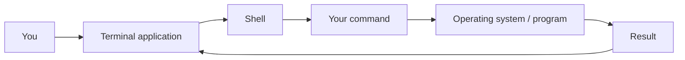
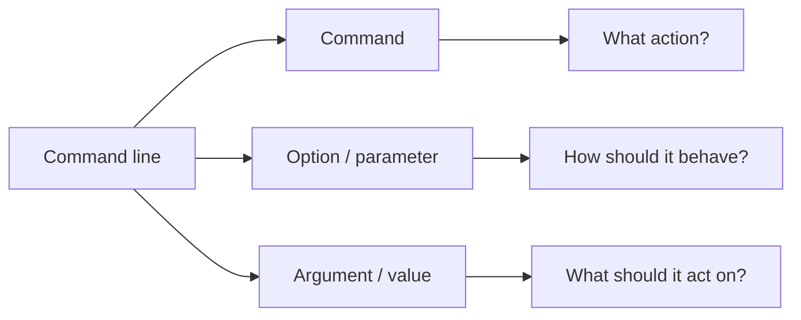
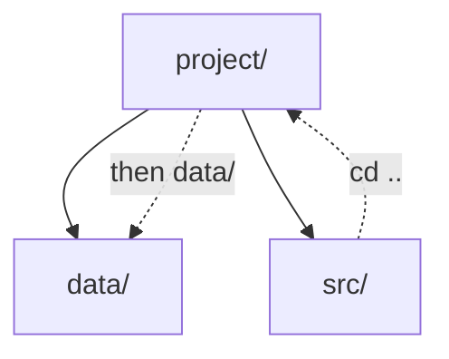
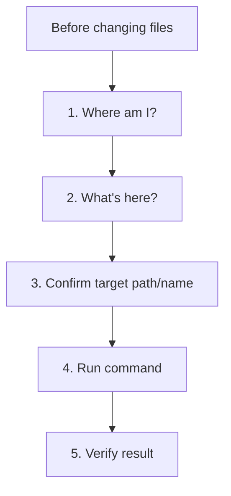

# Command Line from Zero

**Level:** Starter

**Tutorial:** T03

**Prerequisites:** [T00 — How to Start Learning Tech](../start-here/t00-how-to-start-learning-tech.md) | [T01 — How Computers Work](t01-how-computers-work.md) | [T02 — Files, Folders &amp; Paths](t02-files-folders-paths.md)

**Practice:** [GitHub companion](https://github.com/nelsondsouza/learn-with-nelson/tree/main/foundations/t03-command-line-from-zero)

You open a terminal.

You see something like:

```text
PS C:\Users\Nelson>
```

or:

```text
nelson@computer:~$
```

or:

```text
nelson@MacBook ~ %
```

There's no obvious menu telling you what to do next.

Just a cursor.

For many beginners, this is where the command line starts feeling intimidating.

But the command line isn't magic.

You type an instruction.

A shell interprets it.

The computer performs an action.

Then you receive a result.

In T03, we're going to remove the mystery.

By the end, you'll navigate folders, inspect files, create directories, create and read files, copy, move, rename and safely delete practice files—all from the command line.

And because you completed T02, paths such as:

```text
../data/sales.csv
```

already have meaning.

Now we're going to **use them**.

---

## 1. What You'll Learn

By the end of T03, you'll understand:

* what a terminal is
* what a shell is
* terminal vs shell
* Windows Terminal
* PowerShell
* Command Prompt
* Bash
* Zsh
* what a command prompt is
* commands
* arguments
* options and flags
* current working directory
* absolute and relative paths in commands
* listing files and folders
* changing directories
* creating directories
* creating simple text files
* viewing file contents
* copying files
* moving files
* renaming files
* deleting files safely
* removing empty directories
* clearing the screen
* command history
* tab completion
* paths containing spaces
* common terminal errors
* why commands differ between shells

Most importantly, you'll stop seeing the terminal as something reserved for "advanced programmers."

It is simply another way to interact with your computer.

---

## 2. Before You Start

### Required

You need:

* a computer
* permission to create a practice folder
* your operating system's terminal application

### Software installation

For the core T03 exercises:

**None required.**

Your operating system already provides a command-line environment.

---

### Windows

Prefer:

**Windows Terminal + PowerShell**

If Windows Terminal is not available, PowerShell itself is sufficient for this tutorial.

You may also encounter:

**Command Prompt**

We'll explain the difference shortly.

---

### macOS

Use:

**Terminal**

Modern macOS systems commonly use **Zsh** as the default interactive shell.

Many basic commands we'll use are also familiar to Bash users.

---

### Linux

Use the terminal application provided by your desktop environment.

Examples include:

* GNOME Terminal
* Konsole
* Xfce Terminal

Your shell may be Bash, Zsh or something else.

---

### Prerequisites

Complete these first:

[T00 — How to Start Learning Tech](../start-here/t00-how-to-start-learning-tech.md)

[T01 — How Computers Work](t01-how-computers-work.md)

[T02 — Files, Folders &amp; Paths](t02-files-folders-paths.md)

**T02 is especially important.**

You should already understand:

```text
.
..
absolute path
relative path
current directory
parent directory
```

We'll now use those concepts in real commands.

---

### GitHub companion

Exercises, example solutions, practice files, additional resources and Mermaid diagram sources are available here:

[T03 GitHub companion](https://github.com/nelsondsouza/learn-with-nelson/tree/main/foundations/t03-command-line-from-zero)

---

### Safety rule for T03

For this tutorial:

> **Perform file-changing commands only inside the practice folder we create.**

Don't experiment with deletion commands in:

* system folders
* work projects
* repositories you care about
* personal document collections
* directories you don't understand

We will deliberately keep deletion practice simple.

---

## 3. Understand It

# GUI vs Command Line

Until now, you've probably interacted with files mainly through a graphical user interface.

For example:

```text
File Explorer
Finder
Linux file manager
```

You click folders.

You drag files.

You use menus.

That's a **GUI**, or graphical user interface.

The command line provides another interface.

Instead of clicking:

```text
Open folder
```

you can type a command.

Instead of clicking:

```text
Create folder
```

you can type a command.

Instead of dragging a file:

```text
Move file
```

you can type a command.

Neither approach is automatically "better."

They are different tools.

---

# Why Learn the Command Line?

You may wonder:

> If File Explorer or Finder already works, why learn commands?

Because many technical tools are designed around command-line workflows.

You'll encounter the terminal while learning:

* Git
* GitHub
* Python
* Node.js
* package managers
* Docker
* cloud platforms
* Linux
* servers
* databases
* automation
* software development
* data engineering
* machine learning
* AI tooling

Soon we'll type things such as:

```text
git status
```

```text
python app.py
```

```text
pip install ...
```

```text
docker ...
```

Those commands become much less intimidating once you understand the environment they're running in.

---

# Terminal vs Shell

These words are often used casually as though they mean the same thing.

They're related, but not identical.

A useful beginner model is:

> **Terminal = the interface/window**

> **Shell = the command interpreter**

Think of it like this:



You type into the terminal.

The shell interprets your command.

Something happens.

The result appears in the terminal.

---

# What Is a Terminal?

A **terminal application** gives you an interface for interacting with command-line programs and shells.

Examples include:

### Windows

```text
Windows Terminal
```

### macOS

```text
Terminal
```

### Linux

Examples include:

```text
GNOME Terminal
Konsole
Xfce Terminal
```

A terminal application may be able to run different shells.

This distinction is particularly visible in Windows Terminal.

---

# What Is a Shell?

A **shell** interprets commands.

Common examples include:

```text
PowerShell
Bash
Zsh
Command Prompt / cmd.exe
```

Different shells can:

* support different commands
* use different syntax
* provide different scripting features
* behave differently

This is why copying a command from the internet without knowing which shell it was written for can cause problems.

---

# Windows Terminal Is Not PowerShell

This is an important beginner distinction.

**Windows Terminal** is a terminal application.

**PowerShell** is a shell.

Windows Terminal can host environments such as:

```text
PowerShell
Command Prompt
WSL distributions
other command-line profiles
```

So don't automatically treat:

```text
Windows Terminal
```

and:

```text
PowerShell
```

as synonyms.

---

# PowerShell

PowerShell is Microsoft's modern command shell and scripting environment.

You may see a prompt resembling:

```text
PS C:\Users\Nelson>
```

The:

```text
PS
```

is a strong clue that you're using PowerShell.

PowerShell commands frequently have descriptive names such as:

```powershell
Get-Location
```

```powershell
Get-ChildItem
```

```powershell
Copy-Item
```

```powershell
Move-Item
```

```powershell
Remove-Item
```

We'll use these throughout T03.

---

# Command Prompt

Windows also includes the older **Command Prompt**, commonly associated with:

```text
cmd.exe
```

Its prompt might look like:

```text
C:\Users\Nelson>
```

Command Prompt and PowerShell are **not the same shell**.

Some commands work similarly.

Others don't.

For this tutorial, Windows learners should preferably use:

> **PowerShell**

because we'll use it again throughout later technical work.

---

# Bash

Bash stands for:

**Bourne Again Shell**

It is widely associated with Linux and Unix-like development environments.

You'll encounter Bash frequently in:

* Linux
* servers
* cloud environments
* containers
* CI/CD systems
* development documentation

Typical commands include:

```bash
pwd
```

```bash
ls
```

```bash
cd
```

```bash
cp
```

```bash
mv
```

```bash
rm
```

---

# Zsh

Zsh is another Unix shell.

Modern macOS systems commonly use Zsh as the default interactive shell.

Many commands we'll use in T03 are external Unix utilities or shell-compatible patterns familiar across Bash and Zsh environments.

For simplicity, when the same beginner command works for our purposes, we'll label examples:

> **Bash/Zsh**

Later, when shell-specific behavior matters, we'll distinguish them properly.

---

# What Is the Prompt?

Open a terminal and you may see:

```text
PS C:\Users\Nelson>
```

or:

```text
nelson@computer:~$
```

or:

```text
nelson@MacBook ~ %
```

This is the **prompt**.

It tells you that the shell is ready for input.

The prompt may also communicate information such as:

* username
* computer name
* current directory
* shell/environment
* privilege level
* Git branch

depending on its configuration.

---

# Don't Type the Prompt

Suppose a tutorial shows:

```text
PS C:\Users\Nelson> Get-Location
```

You usually type only:

```powershell
Get-Location
```

Do **not** type:

```text
PS C:\Users\Nelson>
```

That's the prompt displayed by the shell.

Similarly, if documentation shows:

```text
$ ls
```

the `$` may be representing the shell prompt.

The command is:

```bash
ls
```

This sounds obvious once explained, but it's a very common first-day mistake.

---

# Anatomy of a Command

A useful beginner model is:

```text
command + options + arguments
```

For example:

```bash
ls -a
```

Here:

```text
ls
```

is the command.

```text
-a
```

is an option.

Another example:

```bash
cd projects
```

Here:

```text
cd
```

is the command.

```text
projects
```

is the argument telling `cd` where to go.

Conceptually:



Not every command has all three.

---

# Options, Flags and Parameters

You'll encounter terms such as:

```text
option
flag
parameter
argument
```

Different tools and ecosystems use these terms somewhat differently.

For now, recognize the basic idea:

Commands can receive additional information that changes:

* what they act on
* how they behave

Example:

```bash
ls -a
```

`-a` changes what `ls` displays.

PowerShell often uses named parameters:

```powershell
Get-ChildItem -Force
```

`-Force` changes the behavior of the command.

You don't need a formal command-line grammar yet.

---

# Your Current Working Directory

T02 introduced the **current directory**.

The shell always has a current location.

You'll also hear:

**working directory**

or:

**current working directory**

Suppose your shell is currently operating from:

```text
project/src/
```

Then a relative path is interpreted from there.

This is why knowing your current location is so important.

---

# Find Your Current Location

## PowerShell

Use:

```powershell
Get-Location
```

PowerShell also commonly supports:

```powershell
pwd
```

as an alias.

---

## Bash/Zsh

Use:

```bash
pwd
```

You'll commonly hear this described as:

**print working directory**

For example, it might display:

```text
/home/nelson/projects
```

or:

```text
/Users/nelson/projects
```

---

# Your First Important Habit

Whenever you feel lost in the terminal, ask:

> **Where am I?**

Then check the current directory.

Many beginner terminal problems disappear once you know your location.

---

# List What's Here

After asking:

> Where am I?

the next question is:

> What's here?

---

## PowerShell

Use:

```powershell
Get-ChildItem
```

This lists items in a location.

PowerShell also has commonly used aliases such as:

```powershell
ls
```

and:

```powershell
dir
```

For learning PowerShell itself, it's useful to recognize the full command:

```powershell
Get-ChildItem
```

---

## Bash/Zsh

Use:

```bash
ls
```

This lists directory contents.

---

# Show Hidden Items

Remember hidden files from T02?

## PowerShell

```powershell
Get-ChildItem -Force
```

## Bash/Zsh

```bash
ls -a
```

Later, when working with Git, you may use this to reveal directories such as:

```text
.git
```

---

# Change Directory

Now we navigate.

Across the shells we're using, you'll frequently use:

```text
cd
```

which means:

**change directory**

Suppose you're here:

```text
projects/
```

and it contains:

```text
learn-with-nelson/
```

You can enter it with:

```text
cd learn-with-nelson
```

Now your current directory changes.

---

# Move to the Parent Directory

T02 taught us:

```text
..
```

means:

**parent directory**

So:

```text
cd ..
```

means:

> change directory to the parent.

This is one of the commands you'll use constantly.

---

# Use a Relative Path

Suppose:

```text
project/
├── data/
└── src/
```

and you're currently in:

```text
project/src/
```

To move directly to:

```text
project/data/
```

you can reason:

```text
..
go to project/

data
enter data/
```

So:

```text
cd ../data
```

Visually:



T02 theory has now become a real command.

---

# Use an Absolute Path

You can also navigate using a complete path.

## Windows / PowerShell

For example:

```powershell
cd "C:\Users\Nelson\Documents"
```

## macOS

```bash
cd "/Users/nelson/Documents"
```

## Linux

```bash
cd "/home/nelson/Documents"
```

Use your own real path.

Don't copy another person's username.

---

# The Home Directory Shortcut

You'll frequently encounter:

```text
~
```

called **tilde**.

In many shell contexts, it represents your home directory.

For example:

```text
cd ~
```

works in PowerShell and common Unix shells for returning to the current user's home location.

In Bash/Zsh, simply:

```bash
cd
```

also normally returns you to your home directory.

For clarity during our exercises, we'll often use:

```text
cd ~
```

---

# Create a Directory

Let's create a folder without clicking.

## PowerShell

A descriptive PowerShell command is:

```powershell
New-Item -ItemType Directory -Name t03-practice
```

PowerShell also supports:

```powershell
mkdir t03-practice
```

---

## Bash/Zsh

Use:

```bash
mkdir t03-practice
```

Now a new directory exists.

You created it using text rather than a GUI.

---

# Why Learn Full PowerShell Commands?

You may wonder why we show:

```powershell
Get-ChildItem
```

when:

```powershell
ls
```

also works.

Because PowerShell aliases can make PowerShell look more like other shells than it really is.

Understanding:

```powershell
Get-ChildItem
```

helps you recognize the PowerShell command model.

Later you'll encounter commands such as:

```powershell
Get-Process
```

```powershell
Get-Service
```

```powershell
Get-Help
```

The naming pattern becomes useful.

We'll still use convenient aliases when appropriate.

---

# Create a Simple File

Let's create a small text file.

## PowerShell

```powershell
"Hello from T03" | Set-Content notes.txt
```

This writes:

```text
Hello from T03
```

into:

```text
notes.txt
```

---

## Bash/Zsh

```bash
echo "Hello from T03" > notes.txt
```

Again, this creates or overwrites `notes.txt` with that text.

---

# A Warning About `>`

The:

```text
>
```

operator can redirect output into a file.

But if the file already exists, it may overwrite its contents depending on the shell and command.

That's why we're using only practice files.

Don't experiment with redirection against valuable files until you understand it properly.

We'll cover shell redirection more deeply later.

---

# View a Text File

## PowerShell

```powershell
Get-Content notes.txt
```

## Bash/Zsh

```bash
cat notes.txt
```

You should see:

```text
Hello from T03
```

Now you've:

1. created a file
2. written content into it
3. read the content

without opening a text editor.

---

# Copy a File

Suppose you have:

```text
notes.txt
```

and want a copy.

## PowerShell

```powershell
Copy-Item notes.txt notes-copy.txt
```

## Bash/Zsh

```bash
cp notes.txt notes-copy.txt
```

You should now have:

```text
notes.txt
notes-copy.txt
```

The original still exists.

That's what distinguishes **copy** from **move**.

---

# Rename a File

## PowerShell

```powershell
Rename-Item notes-copy.txt reference.txt
```

Now:

```text
notes-copy.txt
```

becomes:

```text
reference.txt
```

---

## Bash/Zsh

Unix environments commonly use:

```bash
mv notes-copy.txt reference.txt
```

The `mv` command handles both moving and renaming.

Why?

Conceptually, renaming changes the file's path/name from one location/name to another.

---

# Move a File

Suppose:

```text
reference.txt
```

needs to move into:

```text
docs/
```

## PowerShell

```powershell
Move-Item reference.txt docs/
```

## Bash/Zsh

```bash
mv reference.txt docs/
```

Afterward:

```text
reference.txt
```

is no longer in the original location.

It is inside:

```text
docs/
```

---

# Copy vs Move

Remember:

### Copy

```text
Original remains
+
New copy appears
```

### Move

```text
Original location changes
```

### Rename

```text
Name/path changes
```

These distinctions become important when automating file operations.

---

# Deleting Files

Now we reach a command that deserves respect.

Graphical file managers often move deleted items into a recycle bin or trash.

Command-line deletion may behave differently and can remove files directly.

So our rule is:

> **Delete only practice files deliberately created for deletion.**

---

## PowerShell

To remove:

```text
delete-me.txt
```

use:

```powershell
Remove-Item delete-me.txt
```

---

## Bash/Zsh

Use:

```bash
rm delete-me.txt
```

Before pressing Enter, ask:

> Am I deleting the file I intend to delete?

Then verify the filename.

---

# Why We Aren't Teaching Recursive Delete Yet

You will eventually encounter commands capable of deleting entire directory trees.

We're deliberately **not using them in T03**.

You don't need powerful deletion commands to learn command-line fundamentals.

Learn navigation and verification first.

Power should come after understanding.

---

# Remove an Empty Directory

Suppose you create:

```text
empty-folder/
```

---

## PowerShell

```powershell
Remove-Item empty-folder
```

---

## Bash/Zsh

```bash
rmdir empty-folder
```

The Unix `rmdir` command normally removes an **empty** directory.

That's a useful safety property for beginner practice.

---

# Clear the Screen

After using the terminal for a while, the screen becomes crowded.

## PowerShell

```powershell
Clear-Host
```

or commonly:

```powershell
cls
```

## Bash/Zsh

```bash
clear
```

This clears the visible terminal display.

It does **not** delete your files.

And it doesn't necessarily erase shell history.

---

# Command History

Here's a productivity feature you should start using immediately.

Press:

**Up Arrow**

Your previous command should appear.

Press it repeatedly to move backward through recent commands.

Use:

**Down Arrow**

to move forward again.

This is useful when you typed:

```text
cd ../data
```

and need a similar command again.

Instead of retyping everything, retrieve and edit the previous command.

---

# Tab Completion

Another essential habit:

**Use Tab.**

Suppose a directory is named:

```text
t03-command-line-from-zero
```

Instead of typing the entire name, start:

```text
cd t03
```

then press:

**Tab**

Your shell may complete the path or cycle through matching possibilities.

Tab completion:

* saves typing
* reduces spelling errors
* helps with long filenames
* helps discover matching names

Use it constantly.

---

# Paths with Spaces

Suppose your folder is:

```text
My Projects
```

This contains a space.

A command like:

```text
cd My Projects
```

may be interpreted as multiple pieces.

Use quotes.

## PowerShell

```powershell
cd "C:\Users\Nelson\My Projects"
```

## Bash/Zsh

```bash
cd "/Users/nelson/My Projects"
```

Unix-style shells can also escape spaces:

```bash
cd My\ Projects
```

For beginners, quoting the whole path is usually clearer.

---

# Why Technical Projects Often Avoid Spaces

You'll frequently see project names such as:

```text
learn-with-nelson
```

instead of:

```text
Learn With Nelson
```

Spaces are supported by modern tools, but they can introduce extra quoting and escaping requirements.

For technical projects, simple names such as:

```text
my-project
```

or:

```text
my_project
```

are often easier to work with.

This is a convention, not a universal law.

---

# Relative Paths Become Powerful

Suppose:

```text
project/
├── README.md
├── data/
│   └── sales.csv
├── docs/
└── src/
```

You're currently in:

```text
project/src/
```

The path:

```text
../data/sales.csv
```

can now appear inside:

* commands
* programs
* configuration
* scripts

Your understanding from T02 applies everywhere.

This is why we taught paths **before** the command line.

---

# PowerShell vs Bash/Zsh Commands

Here's a quick comparison.

| Task              | PowerShell                 | Bash/Zsh  |
| ----------------- | -------------------------- | --------- |
| Current directory | `Get-Location` / `pwd` | `pwd`   |
| List files        | `Get-ChildItem` / `ls` | `ls`    |
| Include hidden    | `Get-ChildItem -Force`   | `ls -a` |
| Change directory  | `cd`                     | `cd`    |
| Create directory  | `mkdir`                  | `mkdir` |
| View text file    | `Get-Content`            | `cat`   |
| Copy file         | `Copy-Item`              | `cp`    |
| Move file         | `Move-Item`              | `mv`    |
| Rename file       | `Rename-Item`            | `mv`    |
| Delete file       | `Remove-Item`            | `rm`    |
| Clear screen      | `Clear-Host` / `cls`   | `clear` |

Don't treat this table as something to memorize.

Use it as a reference.

---

# Why Do Some Commands Work in PowerShell Anyway?

You may notice commands such as:

```text
ls
pwd
cd
```

working in PowerShell.

PowerShell provides aliases for some familiar command names.

For example, an alias can point to a PowerShell command.

This improves convenience.

But remember:

> **Same-looking command name does not guarantee identical behavior across shells.**

That's why knowing which shell you're using matters.

---

# Commands Are Often Case-Sensitive—or Their Inputs May Be

Command behavior varies.

PowerShell command names themselves are generally case-insensitive.

Unix command names and filenames may behave differently depending on the environment and file system.

For example:

```text
Sales.csv
```

and:

```text
sales.csv
```

may be different files.

Keep naming consistent.

---

# Common Error 1 — Command Not Found

You type something and receive a message similar to:

```text
command not found
```

or:

```text
is not recognized as the name of a cmdlet...
```

or:

```text
is not recognized as an internal or external command...
```

Possible reasons:

* typo
* wrong shell
* software not installed
* command not available through your environment
* executable not available through the system's command search path

Don't immediately reinstall everything.

Read the error first.

---

# Common Error 2 — Path Not Found

You may see:

```text
No such file or directory
```

or:

```text
Cannot find path...
```

Ask:

1. Where am I?
2. What files/folders are here?
3. Did I spell the name correctly?
4. Is the relative path correct?
5. Is the extension correct?
6. Does capitalization matter here?
7. Did the file move?

This debugging checklist will serve you for years.

---

# Common Error 3 — Access Denied

You may see:

```text
Permission denied
```

or:

```text
Access is denied
```

Don't automatically respond by running everything as:

```text
Administrator
```

or:

```text
root
```

Elevated privileges can make mistakes more damaging.

First understand:

> Why does this operation need additional permission?

For our T03 practice folder, normal user permissions should usually be sufficient.

---

# Common Error 4 — Wrong Shell

You find a command online.

You paste it into PowerShell.

It fails.

The tutorial was written for Bash.

Or the reverse.

Before copying commands, identify:

* operating system
* terminal
* shell
* tool version where relevant

This habit becomes increasingly important as tutorials become more advanced.

---

# Common Error 5 — Copying the Prompt

A tutorial says:

```text
$ python app.py
```

You type:

```text
$ python app.py
```

and get an error.

The `$` may simply be the prompt indicator.

The intended command is:

```text
python app.py
```

Always distinguish:

**prompt**

from:

**command**

---

# Common Error 6 — Running Commands from the Wrong Directory

This will become one of the most important errors in Git and Python tutorials.

You intend to work inside:

```text
project/
```

but your terminal is actually in:

```text
Documents/
```

The command may:

* fail
* operate on the wrong files
* create files in unexpected locations

So develop this habit:

> **Location → inspect → command**

Before an important command:

1. confirm your location
2. inspect what's there
3. then act

---

# A Safe Command-Line Workflow



This five-step pattern is worth remembering.

Especially for:

* moving
* renaming
* overwriting
* deleting

---

## 4. Follow Along

Now we'll actually use the terminal.

Everything below should happen in a practice directory.

---

# Step 1 — Open Your Terminal

## Windows

Open:

**Windows Terminal**

Choose:

**PowerShell**

If you're already in PowerShell, that's fine.

---

## macOS

Open:

**Terminal**

---

## Linux

Open your terminal application.

---

# Step 2 — Identify Your Shell

Look at the prompt.

On Windows, something resembling:

```text
PS C:\Users\...
```

suggests PowerShell.

On macOS/Linux, you may be using Zsh or Bash.

Don't worry if you can't identify every detail yet.

Record:

```text
Operating system:
Terminal application:
Shell:
Prompt:
```

---

# Step 3 — Find Your Current Directory

## PowerShell

```powershell
Get-Location
```

## Bash/Zsh

```bash
pwd
```

Look at the result.

That's where you are.

---

# Step 4 — List What's There

## PowerShell

```powershell
Get-ChildItem
```

## Bash/Zsh

```bash
ls
```

Compare what you see with your graphical file manager if you want.

You're looking at the same file system through a different interface.

---

# Step 5 — Go Home

Use:

```text
cd ~
```

Then confirm your location again.

## PowerShell

```powershell
Get-Location
```

## Bash/Zsh

```bash
pwd
```

---

# Step 6 — Create the Practice Folder

Use:

```text
mkdir t03-practice
```

Then list the directory.

You should see:

```text
t03-practice
```

---

# Step 7 — Enter It

```text
cd t03-practice
```

Confirm your location.

You're now inside your safe practice area.

---

# Step 8 — Create Three Directories

Create:

```text
docs
data
src
```

You can run:

```text
mkdir docs
mkdir data
mkdir src
```

Now list the contents.

You should have:

```text
t03-practice/
├── data/
├── docs/
└── src/
```

---

# Step 9 — Navigate

Enter:

```text
docs
```

using:

```text
cd docs
```

Confirm where you are.

Then return to the parent:

```text
cd ..
```

Now enter:

```text
src
```

Then move directly from:

```text
src/
```

to:

```text
data/
```

using:

```text
cd ../data
```

Think through it:

```text
..
src → parent t03-practice

data
t03-practice → data
```

---

# Step 10 — Create a File

Return to:

```text
docs/
```

You can use:

```text
cd ../docs
```

Now create:

```text
notes.txt
```

## PowerShell

```powershell
"Hello from T03" | Set-Content notes.txt
```

## Bash/Zsh

```bash
echo "Hello from T03" > notes.txt
```

---

# Step 11 — Verify It Exists

List the directory.

## PowerShell

```powershell
Get-ChildItem
```

## Bash/Zsh

```bash
ls
```

You should see:

```text
notes.txt
```

---

# Step 12 — Read It

## PowerShell

```powershell
Get-Content notes.txt
```

## Bash/Zsh

```bash
cat notes.txt
```

Expected output:

```text
Hello from T03
```

---

# Step 13 — Copy It

## PowerShell

```powershell
Copy-Item notes.txt notes-copy.txt
```

## Bash/Zsh

```bash
cp notes.txt notes-copy.txt
```

List again.

You should have:

```text
notes.txt
notes-copy.txt
```

---

# Step 14 — Rename the Copy

## PowerShell

```powershell
Rename-Item notes-copy.txt reference.txt
```

## Bash/Zsh

```bash
mv notes-copy.txt reference.txt
```

List again.

Expected:

```text
notes.txt
reference.txt
```

---

# Step 15 — Move the File

Move:

```text
reference.txt
```

to:

```text
data/
```

Remember: you're currently inside `docs/`.

So the relative destination is:

```text
../data/
```

## PowerShell

```powershell
Move-Item reference.txt ../data/
```

## Bash/Zsh

```bash
mv reference.txt ../data/
```

---

# Step 16 — Verify the Move

Move to:

```text
data/
```

using:

```text
cd ../data
```

List the directory.

You should see:

```text
reference.txt
```

You have now used a relative path to move both yourself and a file.

---

# Step 17 — Safe Deletion Practice

Create:

```text
delete-me.txt
```

## PowerShell

```powershell
"temporary" | Set-Content delete-me.txt
```

## Bash/Zsh

```bash
echo "temporary" > delete-me.txt
```

List the directory.

Confirm:

```text
delete-me.txt
```

exists.

Now delete **only** that file.

## PowerShell

```powershell
Remove-Item delete-me.txt
```

## Bash/Zsh

```bash
rm delete-me.txt
```

List again.

Verify that it is gone.

That's enough deletion practice for T03.

---

# Step 18 — Use Command History

Press:

**Up Arrow**

several times.

Notice previous commands reappear.

Edit one rather than retyping it.

This habit becomes invaluable as commands get longer.

---

# Step 19 — Use Tab Completion

Return to:

```text
t03-practice/
```

Start typing:

```text
cd d
```

Then press:

**Tab**

Depending on the shell and matches, it may complete or cycle through names such as:

```text
data
docs
```

Experiment safely with Tab completion.

---

# Step 20 — Clear the Screen

## PowerShell

```powershell
Clear-Host
```

## Bash/Zsh

```bash
clear
```

Your practice files are still there.

Only the displayed terminal content was cleared.

---

## 5. Try It Yourself

Now repeat the core skills without copying every command from above.

### Exercise 1 — Navigation

Create:

```text
navigation-practice/
├── alpha/
├── beta/
└── gamma/
```

Start inside:

```text
alpha/
```

Navigate to:

```text
beta/
```

using a relative path.

Then navigate to:

```text
gamma/
```

without returning home.

---

### Exercise 2 — File Operations

Inside a safe practice directory:

1. create `original.txt`;
2. put a short sentence inside;
3. display its contents;
4. copy it to `copy.txt`;
5. rename the copy to `reference.txt`;
6. move `reference.txt` into another practice directory;
7. verify both files are where you expect.

---

### Exercise 3 — Spaces

Create a directory named:

```text
My Practice
```

Navigate into it using quotes.

Then return to the parent.

---

### Exercise 4 — Diagnose

Suppose your project is:

```text
project/
├── data/
│   └── sales.csv
└── src/
```

You're currently in:

```text
project/src/
```

Someone runs:

```text
cat data/sales.csv
```

and gets:

```text
No such file or directory
```

Why?

What relative path should they use?

Don't guess.

Draw the hierarchy.

---

### GitHub exercises

Complete:

[Open Your Terminal](https://github.com/nelsondsouza/learn-with-nelson/blob/main/foundations/t03-command-line-from-zero/exercises/open-your-terminal.md)

[Navigation Practice](https://github.com/nelsondsouza/learn-with-nelson/blob/main/foundations/t03-command-line-from-zero/exercises/navigation-practice.md)

[File Operations Practice](https://github.com/nelsondsouza/learn-with-nelson/blob/main/foundations/t03-command-line-from-zero/exercises/file-operations-practice.md)

---

## 6. Common Mistakes

### Mistake 1 — Copying the prompt

If documentation shows:

```text
$ ls
```

you usually type:

```text
ls
```

not the `$`.

---

### Mistake 2 — Not knowing your current directory

Before debugging a path, check:

```text
Where am I?
```

Then:

```text
What's here?
```

---

### Mistake 3 — Copying commands for the wrong shell

A Bash command isn't automatically a PowerShell command.

Identify your environment first.

---

### Mistake 4 — Copying someone else's absolute path

Their:

```text
C:\Users\John\...
```

isn't necessarily your:

```text
C:\Users\<your-user>\...
```

Use your actual paths.

---

### Mistake 5 — Forgetting quotes around paths with spaces

This:

```text
My Projects
```

may need:

```text
"My Projects"
```

when used as one path argument.

---

### Mistake 6 — Typing every filename manually

Use **Tab completion**.

It saves time and reduces mistakes.

---

### Mistake 7 — Repeating long commands manually

Use **command history**.

Press Up Arrow.

Edit.

Run again.

---

### Mistake 8 — Treating an error message as failure

Errors are information.

Read them.

For example:

```text
No such file or directory
```

already tells you where to investigate.

---

### Mistake 9 — Using Administrator/root unnecessarily

Don't elevate privileges simply because a command failed.

Understand the permission problem first.

---

### Mistake 10 — Running delete commands casually

Pause.

Check:

```text
Where am I?
What exactly am I deleting?
```

Then act.

---

### Mistake 11 — Copying powerful commands you don't understand

You will eventually encounter internet answers containing commands with:

* recursive deletion
* force options
* administrator privileges
* shell pipelines
* downloads followed by execution

Don't run a command merely because someone says:

> "Paste this."

Understand the important parts first.

This becomes even more important when using AI-generated commands.

---

## 7. Use AI

AI can be extremely useful when learning the command line.

But this is also where blindly copying AI output can become dangerous.

So we use AI differently.

---

# Ask AI to Explain a Command

Suppose you encounter:

```bash
ls -la
```

Instead of simply running it, ask:

```text
I am learning the command line.

Explain this command:

ls -la

Break it into:
1. command,
2. each option,
3. what output I should expect,
4. whether it changes any files.

Do not assume I already understand shell terminology.
```

The final question is especially useful:

> **Does this command change anything?**

---

# Ask AI to Translate Between Shells

Suppose documentation provides:

```bash
cp notes.txt backup.txt
```

but you're learning PowerShell.

Ask:

```text
This command was written for Bash:

cp notes.txt backup.txt

I am using PowerShell.

Show me the idiomatic PowerShell equivalent.

Explain what both commands do and identify whether either command can overwrite an existing file.
```

Now AI is helping you understand cross-platform differences.

---

# Ask AI to Diagnose Navigation

Try:

```text
My project tree is:

project/
├── data/
│   └── sales.csv
├── docs/
└── src/
    └── app.py

My current directory is:

project/src/

I want to reach sales.csv.

Do not immediately give me a command.

First ask me what relative path I think should work.

Then check my reasoning.
```

That's AI as a tutor rather than an answer machine.

---

# Ask AI to Check Safety

Before running an unfamiliar file-changing command, you can ask:

```text
I am a beginner.

Explain what this command does before I run it.

Tell me:
1. what it reads,
2. what it creates,
3. what it changes,
4. what it deletes,
5. whether it is recursive,
6. whether it needs elevated privileges,
7. the safest way to test it in a temporary practice directory.

Command:

[PASTE COMMAND]
```

This does **not** make every AI answer automatically safe.

You still need to verify.

Our rule remains:

**Ask → Understand → Verify → Apply**

---

# Never Give AI More Access Than Necessary

As we progress, AI tools may eventually be able to:

* read files
* edit code
* run terminal commands
* use Git
* install packages

That makes them powerful.

It also means:

> **The more access an AI tool has, the more carefully you should review what it proposes to do.**

We'll build that habit from the beginning.

---

## 8. Mini Challenge

# Build a Project from the Command Line

Without using your graphical file manager after you begin, create:

```text
command-line-project/
├── README.txt
├── data/
│   ├── raw/
│   └── processed/
├── docs/
└── src/
```

Put this text inside:

```text
README.txt
```

```text
My first command-line project.
```

Then complete these tasks:

1. confirm your current directory;
2. list the project contents;
3. navigate into `data/raw`;
4. navigate from `data/raw` to `src` using a relative path;
5. return to the project root;
6. display the contents of `README.txt`;
7. create `temporary.txt`;
8. verify that it exists;
9. delete only `temporary.txt`;
10. verify that the rest of the project remains unchanged.

### Extra challenge

Create:

```text
docs/notes.txt
```

Copy it to:

```text
docs/notes-backup.txt
```

Then rename the backup to:

```text
docs/reference.txt
```

Don't copy the tutorial commands line by line.

Work out the commands yourself.

The GitHub version is here:

[Command-Line Mini Challenge](https://github.com/nelsondsouza/learn-with-nelson/blob/main/foundations/t03-command-line-from-zero/exercises/mini-challenge.md)

---

## 9. Cheat Sheet

### Core concepts

| Term              | Beginner meaning                                                      |
| ----------------- | --------------------------------------------------------------------- |
| Terminal          | Application/interface used to interact with command-line environments |
| Shell             | Program that interprets commands                                      |
| Prompt            | Indicator showing the shell is ready for input                        |
| Command           | Instruction you ask the shell/program to perform                      |
| Argument          | Value supplied to a command                                           |
| Option/Flag       | Modifier that changes command behavior                                |
| Working Directory | Current directory from which relative paths are interpreted           |
| `.`             | Current directory                                                     |
| `..`            | Parent directory                                                      |
| `~`             | Common shorthand for the user's home directory                        |

### Navigation

| Task              | PowerShell                 | Bash/Zsh      |
| ----------------- | -------------------------- | ------------- |
| Current directory | `Get-Location` / `pwd` | `pwd`       |
| List contents     | `Get-ChildItem` / `ls` | `ls`        |
| Hidden items      | `Get-ChildItem -Force`   | `ls -a`     |
| Change directory  | `cd folder`              | `cd folder` |
| Parent directory  | `cd ..`                  | `cd ..`     |
| Home              | `cd ~`                   | `cd ~`      |
| Clear screen      | `Clear-Host` / `cls`   | `clear`     |

### File operations

| Task                | PowerShell                  | Bash/Zsh             |
| ------------------- | --------------------------- | -------------------- |
| Create directory    | `mkdir folder`            | `mkdir folder`     |
| Read text file      | `Get-Content file.txt`    | `cat file.txt`     |
| Copy file           | `Copy-Item a.txt b.txt`   | `cp a.txt b.txt`   |
| Rename file         | `Rename-Item a.txt b.txt` | `mv a.txt b.txt`   |
| Move file           | `Move-Item a.txt folder/` | `mv a.txt folder/` |
| Delete file         | `Remove-Item file.txt`    | `rm file.txt`      |
| Remove empty folder | `Remove-Item folder`      | `rmdir folder`     |

### Productivity

```text
Up Arrow
previous command
```

```text
Down Arrow
move forward through command history
```

```text
Tab
complete/cycle file or directory names
```

### Safety check

Before a file-changing command:

```text
1. Where am I?
2. What's here?
3. What is my target?
4. What will this command change?
5. Verify afterward.
```

---

## 10. What You Now Know

You started T03 looking at a blinking cursor.

Now you should understand what's behind it.

You know that:

* a terminal and a shell aren't the same thing;
* Windows Terminal can host different shells;
* PowerShell and Command Prompt are different;
* Bash and Zsh are Unix shells;
* the prompt tells you the shell is ready;
* you don't normally type the prompt itself;
* commands can receive options and arguments;
* every shell has a current working directory;
* relative paths depend on that location;
* `cd ..` moves to the parent;
* `~` commonly refers to your home directory;
* you can list directory contents;
* you can create directories;
* you can create and inspect simple text files;
* you can copy, move and rename files;
* command-line deletion deserves extra care;
* history prevents unnecessary retyping;
* Tab completion reduces mistakes;
* paths containing spaces often need quoting;
* commands differ between shells;
* error messages are useful debugging information;
* elevated privileges shouldn't be your first solution;
* you should understand unfamiliar commands before running them.

Most importantly, something like:

```text
cd ../data
```

should no longer look like obscure programmer language.

You can reason:

```text
cd
change directory

..
go to parent

data
enter data
```

That's the foundation we need.

---

## 11. Next Tutorial

# T04 — VS Code from Zero

You can now navigate your computer using the command line.

Next, we need a proper workspace for writing and organizing code.

In T04, we'll introduce **Visual Studio Code**.

You'll learn:

* what a code editor is
* code editor vs IDE
* VS Code vs Visual Studio
* how to install VS Code safely
* the VS Code interface
* Explorer
* editor tabs
* command palette
* integrated terminal
* opening a folder vs opening a file
* creating files and folders
* saving files
* syntax highlighting
* extensions
* extension publishers and trust
* settings
* keyboard shortcuts
* workspace concepts
* opening your project from the command line
* using AI features responsibly
* how VS Code will become our main learning workspace

T04 will also be our first tutorial in this foundation sequence that requires us to deliberately install a major development tool.

### Before continuing

Complete the T03 exercises:

[Open Your Terminal](https://github.com/nelsondsouza/learn-with-nelson/blob/main/foundations/t03-command-line-from-zero/exercises/open-your-terminal.md)

[Navigation Practice](https://github.com/nelsondsouza/learn-with-nelson/blob/main/foundations/t03-command-line-from-zero/exercises/navigation-practice.md)

[File Operations Practice](https://github.com/nelsondsouza/learn-with-nelson/blob/main/foundations/t03-command-line-from-zero/exercises/file-operations-practice.md)

[Command-Line Mini Challenge](https://github.com/nelsondsouza/learn-with-nelson/blob/main/foundations/t03-command-line-from-zero/exercises/mini-challenge.md)

Then compare your work with:

[Navigation Example Solution](https://github.com/nelsondsouza/learn-with-nelson/blob/main/foundations/t03-command-line-from-zero/solutions/navigation-example.md)

[File Operations Example Solution](https://github.com/nelsondsouza/learn-with-nelson/blob/main/foundations/t03-command-line-from-zero/solutions/file-operations-example.md)

[Open the T03 GitHub companion](https://github.com/nelsondsouza/learn-with-nelson/tree/main/foundations/t03-command-line-from-zero){ .md-button }

**Next: T04 — VS Code from Zero**
