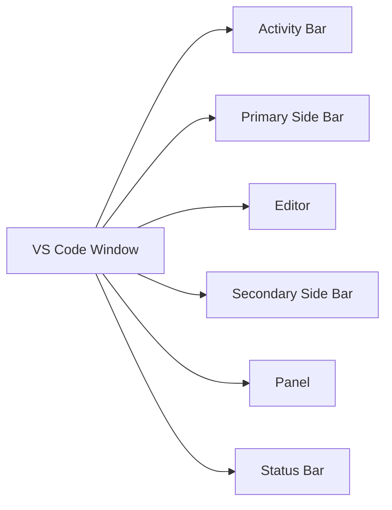
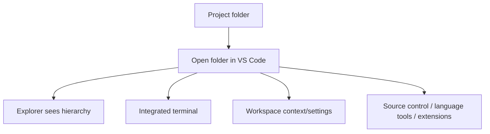
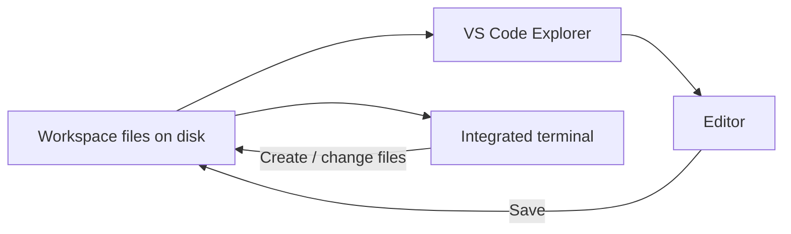
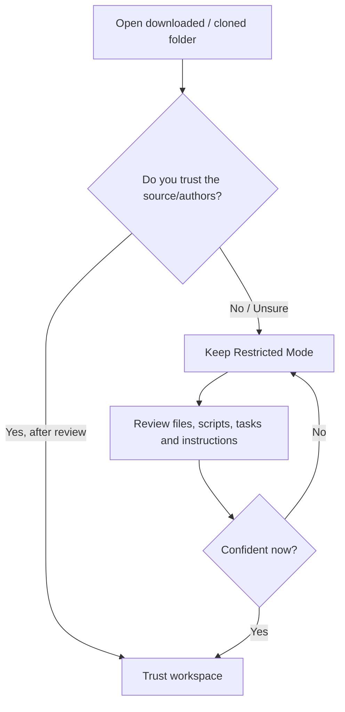

# VS Code from Zero

**Level:** Starter

**Tutorial:** T04

**Prerequisites:** 

[T00 — How to Start Learning Tech](../start-here/t00-how-to-start-learning-tech.md)

[T01 — How Computers Work](t01-how-computers-work.md)

[T02 — Files, Folders & Paths](t02-files-folders-paths.md)

[T03 — Command Line from Zero](t03-command-line-from-zero.md)

**Practice:** [GitHub companion](https://github.com/nelsondsouza/learn-with-nelson/tree/main/foundations/t04-vscode-from-zero)

Until now, we have learned how computers work, how files and paths are organized, and how to navigate using the command line.

Now we need a proper place to work.

That place will be **Visual Studio Code**, usually called **VS Code**.

VS Code will become the main workspace for many future Learn with Nelson tutorials.

You will use it to:

* write code
* create and organize files
* work with projects
* use the terminal
* work with Git
* install language tooling
* debug applications
* work with extensions
* eventually use AI-assisted development tools

But before we use VS Code as professionals do, we need to understand the environment itself.

---

## 1. What You'll Learn

By the end of T04, you'll understand and use:

* what a code editor is
* what an IDE is
* VS Code vs Visual Studio
* how to install VS Code safely
* the Activity Bar
* Primary Side Bar
* Secondary Side Bar
* Explorer
* Editor
* Panel
* Status Bar
* tabs
* opening a file vs opening a folder
* workspace basics
* creating files and folders
* saving files
* syntax highlighting
* language modes
* Command Palette
* Quick Open
* integrated terminal
* `code .`
* User settings
* Workspace settings
* extensions
* extension safety
* Workspace Trust
* Restricted Mode
* useful keyboard shortcuts
* basic AI/agent safety inside VS Code

The objective is not to customize every feature.

It is to become comfortable enough that VS Code stops feeling like a complicated application and starts feeling like your workspace.

---

## 2. Before You Start

### Required

You need:

* a Windows, macOS, or Linux computer
* internet access
* permission to install VS Code
* access to a terminal

### Prerequisites

Complete:

[T00 — How to Start Learning Tech](../start-here/t00-how-to-start-learning-tech.md)

[T01 — How Computers Work](t01-how-computers-work.md)

[T02 — Files, Folders & Paths](t02-files-folders-paths.md)

[T03 — Command Line from Zero](t03-command-line-from-zero.md)

T02 and T03 are especially important because VS Code works directly with:

* folders
* paths
* files
* terminal commands

### GitHub companion

Exercises, example workspaces, solutions, additional resources and Mermaid diagram sources are available here:

[T04 GitHub companion](https://github.com/nelsondsouza/learn-with-nelson/tree/main/foundations/t04-vscode-from-zero)

---

## 3. Understand It

# What Is a Code Editor?

A **code editor** is software designed for writing and editing source code.

You could technically write Python using a basic text editor.

But a code editor provides features that make software work much easier.

Examples include:

* syntax highlighting
* file navigation
* search
* extensions
* terminals
* source-control integration
* debugging support
* language tooling

VS Code is one of the most widely used code editors.

---

# What Is an IDE?

IDE stands for:

**Integrated Development Environment**

An IDE typically combines several development capabilities into one environment.

These can include:

* editor
* compiler/build tools
* debugger
* project management
* testing
* source control
* language tooling

Examples include:

* Visual Studio
* IntelliJ IDEA
* PyCharm

VS Code began as a lightweight editor but can gain many IDE-like capabilities through built-in features and extensions.

For beginners, the practical distinction matters more than the label:

> **VS Code is where we will work with technical projects.**

---

# VS Code vs Visual Studio

These names are easy to confuse.

They are different products.

## Visual Studio Code

Commonly called:

**VS Code**

It is:

* cross-platform
* lightweight compared with many full IDEs
* extensible
* useful for many languages and workflows

It runs on:

* Windows
* macOS
* Linux

## Visual Studio

Visual Studio is a different Microsoft development environment.

It is especially common in:

* .NET
* C#
* Windows development
* larger Microsoft development workflows

When this tutorial says:

> Open VS Code

it means:

> **Visual Studio Code**

not Visual Studio.

---

# Install VS Code from the Official Source

Use:

**https://code.visualstudio.com/**

Avoid random third-party download sites.

Development tools eventually gain access to:

* source code
* terminals
* Git credentials
* project files
* extensions

So installation source matters.

---

# Windows Installation

Download the current Windows installer from the official VS Code website.

For normal individual use, Microsoft's **User Setup** installer is a common choice.

Run the installer and follow the setup steps.

After installation, close and reopen any terminal windows that were already running.

This matters because the installation may update your environment so the terminal can find:

```text

code

```

---

# Verify the `code` Command on Windows

Open PowerShell.

Run:

```powershell

code --version

```

If VS Code's command-line interface is available, you should see version information.

Later we'll use:

```text

code .

```

constantly.

---

# macOS Installation

Download the official VS Code `.dmg`.

Open it.

Drag:

```text

Visual Studio Code.app

```

into:

```text

Applications

```

Then launch VS Code.

---

# Enable `code` on macOS

The `code` terminal command may not initially be available.

Inside VS Code:

1. open the **Command Palette**;
2. search for:

```text

Shell Command: Install 'code' command in PATH

```

3. run it;
4. close and reopen your terminal;
5. test:

```bash

code --version

```

If you see version information, you're ready.

---

# Linux Installation

Linux installation depends on the distribution.

Current official VS Code documentation provides instructions for formats and distributions such as:

* `.deb`
* `.rpm`
* Snap
* distribution-specific package repositories

Do not copy an Ubuntu installation command into a different Linux distribution simply because it appeared in a blog post.

Use the current official Linux setup documentation.

---

# First Launch

When VS Code opens, it may show:

* a Welcome page
* recent projects
* getting-started material
* extension recommendations
* AI-related features
* account/sign-in options

Your exact screen may differ from screenshots online.

That's normal.

VS Code changes frequently.

Instead of trying to make your screen identical to mine, learn the main concepts.

---

# The VS Code Interface

A simplified mental model:



Let's understand each area.

---

# Activity Bar

The Activity Bar gives access to major views.

Depending on your installed version and extensions, you may see entries such as:

* Explorer
* Search
* Source Control
* Run and Debug
* Extensions

You may also see additional views contributed by extensions or AI tooling.

Think of the Activity Bar as:

> **Major workspace modes**

---

# Primary Side Bar

The Primary Side Bar displays information for the active view.

For example, select:

**Explorer**

and the Primary Side Bar shows your project's files and folders.

Select:

**Extensions**

and it shows extension-related information.

---

# Explorer

Explorer is one of the most important VS Code views for beginners.

It displays the files and folders of your current project/workspace.

Example:

```text
my-project/
├── README.md
├── data/
├── docs/
└── src/
```

From Explorer, you can:

* create files
* create directories
* open files
* rename
* move
* delete

This is essentially a project-focused file manager inside VS Code.

---

# Editor

The Editor is the main area where file contents appear.

Open:

```text
README.md
```

and its contents appear in the Editor.

Open:

```text
app.py
```

and Python source code appears there.

Multiple files can remain open in tabs.

---

# Tabs

When multiple files are open, VS Code normally displays them as tabs.

For example:

```text
README.md | notes.txt | app.py
```

This lets you switch between files without reopening them repeatedly.

---

# Panel

The Panel usually appears near the bottom.

It can contain tools such as:

* Terminal
* Problems
* Output
* Debug Console

The one we'll use first is:

**Terminal**

because T03 already taught you how shells work.

---

# Status Bar

The Status Bar appears at the bottom.

It can show information such as:

* language mode
* Git branch
* warnings/errors
* encoding
* line/column
* environment information

The exact items depend on your current file and installed extensions.

---

# Secondary Side Bar

Modern VS Code versions can also display a Secondary Side Bar.

Depending on your configuration, it may contain:

* Chat
* additional views
* extension-provided tools

You do not need to use it immediately.

Recognize that VS Code can host multiple sidebars and views.

---

# Open a File vs Open a Folder

This is one of the most important habits in T04.

You *can* open one file:

```text
app.py
```

But for project work, it is usually better to open:

```text
my-project/
```

as a folder.

Why?

Because then VS Code understands the project context.

---

# Why Opening the Folder Matters

Suppose:

```text
project/
├── README.md
├── data/
│   └── sales.csv
└── src/
    └── app.py
```

If you open only:

```text
app.py
```

you see the file.

But if you open:

```text
project/
```

you gain the whole context.



That's why our default habit will be:

> **Open the project folder.**

---

# What Is a Workspace?

In VS Code, a **workspace** broadly represents the folder or collection of folders you're working with.

For most beginner tutorials:

> **One project folder = one practical workspace**

VS Code also supports multi-root workspaces.

We don't need those yet.

---

# Create Your First Workspace

Create:

```text
t04-first-workspace
```

Then inside VS Code:

**File → Open Folder**

Choose:

```text
t04-first-workspace
```

The Explorer should now show that folder.

---

# Create Files and Folders

Inside Explorer, create:

```text
README.md
notes.txt
```

Create folders:

```text
data
docs
src
```

Your workspace should become:

```text
t04-first-workspace/
├── README.md
├── notes.txt
├── data/
├── docs/
└── src/
```

You already understand this hierarchy because of T02.

---

# Saving Files

Open:

```text
README.md
```

and type:

```markdown
# My First VS Code Workspace

I am learning how to work with folders and files in VS Code.
```

Then save.

## Windows/Linux

```text
Ctrl+S
```

## macOS

```text
Cmd+S
```

Saving writes your edited content to storage.

T01 already taught why this distinction matters.

---

# Unsaved Changes

When a file contains changes not yet saved, VS Code normally shows a visual indicator in the tab.

Don't ignore it.

Develop this habit:

> **Edit → Save → Verify**

Later your tools will run code from the saved file.

If your editor contains new code but you forgot to save it, you may run the old version and wonder why nothing changed.

---

# Auto Save

VS Code supports Auto Save.

This can save files automatically based on settings such as:

* delay
* focus change
* window change

Auto Save can be convenient.

But for beginners, understand manual saving first.

Then enable Auto Save if it suits your workflow.

---

# Syntax Highlighting

Create or open different file types.

For example:

```text
README.md
notes.txt
app.py
index.html
```

VS Code displays different syntax using different visual styles.

This is called:

**syntax highlighting**

It makes code easier to read.

But remember:

> Colored code is not necessarily correct code.

---

# Language Mode

Look at the Status Bar while:

```text
README.md
```

is active.

VS Code may identify it as:

```text
Markdown
```

A `.py` file might be identified as:

```text
Python
```

This is the **language mode**.

It tells VS Code how to interpret and support the current document.

---

# Correct File Extensions Matter

Don't rename:

```text
notes.txt
```

to:

```text
notes.py
```

just because you want Python colors.

The extension should reflect the file's intended format/content.

T02 taught why changing the extension alone does not transform the underlying meaning or format.

---

# Command Palette

The Command Palette is one of the best VS Code features to learn early.

Instead of searching menus, search for the action.

## Windows/Linux

```text
Ctrl+Shift+P
```

## macOS

```text
Cmd+Shift+P
```

You'll get a searchable list of available commands.

Examples might include:

```text
Preferences: Open Settings
View: Toggle Terminal
Developer: ...
Git: ...
```

The list depends on your installed VS Code version and extensions.

---

# Why the Command Palette Is So Useful

Suppose someone says:

> Change the default formatter.

You don't know which menu contains that option.

Open the Command Palette and search:

```text
format
```

This is often much faster than memorizing menu paths.

---

# Quick Open

When projects get larger, expanding folders manually becomes slow.

Use Quick Open.

## Windows/Linux

```text
Ctrl+P
```

## macOS

```text
Cmd+P
```

Type part of a filename.

For example:

```text
read
```

and VS Code may suggest:

```text
README.md
```

Select it.

This is a habit worth developing early.

---

# The Integrated Terminal

VS Code includes a terminal inside the editor window.

Open:

**Terminal → New Terminal**

You'll see a shell.

Depending on your environment, this may be:

* PowerShell
* Bash
* Zsh
* another configured shell

The integrated terminal is not a toy terminal.

It's a real shell.

Commands can:

* create files
* modify files
* delete files
* run programs
* use Git
* install packages

So every T03 safety rule still applies.

---

# Explorer and Terminal Work on the Same Files

This is an important mental model.



Explorer is not a separate copy of your project.

The terminal is not a separate copy either.

They're both interfaces to the same files.

---

# Create a File from the Terminal

Inside your first workspace, open the integrated terminal.

## PowerShell

```powershell
"Created from the integrated terminal" | Set-Content terminal-note.txt
```

## Bash/Zsh

```bash
echo "Created from the integrated terminal" > terminal-note.txt
```

Now look at Explorer.

You should see:

```text
terminal-note.txt
```

appear.

That's the same file system viewed from two interfaces.

---

# The `code` Command

VS Code includes a command-line interface.

Once installed and available in PATH, you can use:

```text
code
```

from a terminal.

One of the most useful commands is:

```text
code .
```

---

# What Does `code .` Mean?

Break it down.

```text
code
```

means:

> Open/use Visual Studio Code.

```text
.
```

means:

> current directory.

So:

```text
code .
```

means:

> **Open the current directory in VS Code.**

This is one reason we taught `.` in T02 and the command line in T03 before VS Code.

---

# A Typical Workflow

Soon you'll frequently do:

```text
cd my-project
code .
```

That's:

```text
Navigate to project
        ↓
Open current project in VS Code
```

This will become second nature.

---

# Settings

VS Code is highly configurable.

Open Settings using the menu or Command Palette.

You'll see many options.

Do **not** try to customize everything on your first day.

Defaults exist for a reason.

Change a setting when you understand:

* what it changes
* why you want it changed

---

# User Settings vs Workspace Settings

This distinction matters.

## User Settings

Apply broadly to your VS Code environment.

Examples might include:

* font size
* theme
* editor preferences

## Workspace Settings

Apply to a specific workspace/project.

This allows one project to use settings different from another.

Later you may encounter project configuration inside:

```text
.vscode/
```

You don't need to create this manually today.

Just recognize that some settings can belong to the project.

---

# Extensions

Extensions add capabilities to VS Code.

Examples can include:

* language support
* debugging
* formatting
* linting
* database integrations
* container tooling
* cloud tooling
* themes
* AI tools

You'll install several useful extensions later.

But don't turn extension installation into a collection hobby.

---

# Don't Install Every Recommended Extension

A tutorial screenshot may show 30 extensions.

You do not need all 30.

Every extension:

* adds code to your environment
* may consume resources
* may change behavior
* may receive updates
* may introduce conflicts
* may have security implications

Install what you need.

---

# Treat Extensions as Software

Before installing an extension, ask:

1. What does it do?
2. Why do I need it?
3. Who publishes it?
4. Is it official or well established?
5. What permissions/capabilities does it require?
6. Is it actively maintained?

This is a more professional habit than:

> It has a cool icon, so I installed it.

---

# Workspace Trust

VS Code includes a security concept called:

**Workspace Trust**

This becomes important when you open:

* downloaded projects
* Git repositories
* code samples
* unknown folders

A project can contain instructions or configuration capable of causing code execution through:

* tasks
* debugging
* extensions
* scripts
* build tooling
* other automation

---

# Restricted Mode

If you don't trust a workspace, VS Code can keep it in:

**Restricted Mode**

This limits some capabilities that could execute code.

A beginner rule worth keeping:

> **If you do not trust the source of a project, don't automatically trust the workspace.**

Inspect first.

---

# Trust Decision

Think through it like this:



Trust is not a button you should click just to make a warning disappear.

It's a security decision.

---

# What Should You Review?

If a downloaded project says:

```text
Run this setup script.
```

or:

```text
Install these packages.
```

or:

```text
Enable this extension.
```

you should understand what those actions do.

You don't need to perform a complete security audit as a beginner.

But don't blindly approve everything.

---

# AI in VS Code

Modern VS Code can include substantial AI functionality, depending on:

* installed tools
* account access
* configuration
* GitHub Copilot features
* extensions
* agent/tooling integrations

AI features may be able to:

* explain files
* generate code
* edit files
* create files
* search the workspace
* run commands
* interact with development tools

This is powerful.

And that's exactly why the safety habits matter.

---

# AI Suggestions vs AI Actions

There's a big difference between AI saying:

> Here's a code suggestion.

and AI doing:

> I changed six files and ran three terminal commands.

As AI systems become more agentic, always understand the scope of an action.

Ask:

```text
What files will this change?
What command will run?
Will anything be deleted?
Will packages be installed?
Will credentials or external services be accessed?
```

---

# Workspace Trust Matters Even More with AI

Suppose:

* you downloaded unknown code;
* opened it in VS Code;
* trusted the workspace;
* enabled an AI agent;
* allowed it to run commands.

You have now combined several powerful capabilities.

That's not inherently wrong.

But each trust decision matters.

We'll teach AI as part of modern development—not as permission to stop thinking.

---

# Keyboard Shortcuts Worth Knowing

Start small.

| Task            | Windows/Linux  | macOS         |
| --------------- | -------------- | ------------- |
| Save            | `Ctrl+S`       | `Cmd+S`       |
| Command Palette | `Ctrl+Shift+P` | `Cmd+Shift+P` |
| Quick Open      | `Ctrl+P`       | `Cmd+P`       |
| Find            | `Ctrl+F`       | `Cmd+F`       |
| New File        | `Ctrl+N`       | `Cmd+N`       |

You do not need a 100-shortcut cheat sheet today.

Master shortcuts through repetition.

---

## 4. Follow Along

Let's build a real VS Code workspace.

---

# Step 1 — Install VS Code

Use:

**https://code.visualstudio.com/**

Install the correct version for your operating system.

Open VS Code.

---

# Step 2 — Verify `code`

Open a terminal.

Run:

```text
code --version
```

If version information appears, continue.

If not:

* Windows: restart the terminal first;
* macOS: install the `code` shell command from the Command Palette;
* Linux: check the installation method and official documentation.

---

# Step 3 — Create Your Workspace Folder

Using File Explorer, Finder, or the terminal, create:

```text
t04-first-workspace
```

---

# Step 4 — Open the Folder

Inside VS Code:

**File → Open Folder**

Select:

```text
t04-first-workspace
```

Don't just create and open a random file.

Open the folder.

---

# Step 5 — Identify the Interface

Find:

* Activity Bar
* Explorer
* Editor
* Panel
* Status Bar

If your version shows a Secondary Side Bar, identify it too.

Don't worry if your arrangement differs slightly.

---

# Step 6 — Create the Folder Structure

Using Explorer, create:

```text
README.md
notes.txt
data/
docs/
src/
```

Expected:

```text
t04-first-workspace/
├── README.md
├── notes.txt
├── data/
├── docs/
└── src/
```

---

# Step 7 — Edit README

Open:

```text
README.md
```

Add:

```markdown
# My First VS Code Workspace

I am learning how to work with folders and files in VS Code.
```

Save.

---

# Step 8 — Edit Notes

Open:

```text
notes.txt
```

Add:

```text
VS Code is my learning workspace.
```

Save.

---

# Step 9 — Notice Language Modes

Switch between:

```text
README.md
```

and:

```text
notes.txt
```

Look at the Status Bar.

Notice how VS Code recognizes them differently.

---

# Step 10 — Create a Nested File

Inside:

```text
docs/
```

create:

```text
learning-notes.md
```

Add:

```markdown
# Learning Notes

I am practicing VS Code navigation.
```

Save.

---

# Step 11 — Rename It

Rename:

```text
learning-notes.md
```

to:

```text
vscode-notes.md
```

Notice Explorer updates immediately.

---

# Step 12 — Use Quick Open

Press:

## Windows/Linux

```text
Ctrl+P
```

## macOS

```text
Cmd+P
```

Type:

```text
read
```

Select:

```text
README.md
```

You just found a file without navigating the folder tree.

---

# Step 13 — Use the Command Palette

Press:

## Windows/Linux

```text
Ctrl+Shift+P
```

## macOS

```text
Cmd+Shift+P
```

Search:

```text
settings
```

Open Settings.

Don't change anything unless you know why.

The point is learning how to find commands.

---

# Step 14 — Open the Integrated Terminal

Use:

**Terminal → New Terminal**

Check your location.

## PowerShell

```powershell
Get-Location
```

## Bash/Zsh

```bash
pwd
```

Confirm where the terminal actually started.

---

# Step 15 — List Workspace Files

## PowerShell

```powershell
Get-ChildItem
```

## Bash/Zsh

```bash
ls
```

Compare the terminal output to Explorer.

Same files.

Same folder.

Different interface.

---

# Step 16 — Create a File from the Terminal

## PowerShell

```powershell
"Created from the integrated terminal" | Set-Content terminal-note.txt
```

## Bash/Zsh

```bash
echo "Created from the integrated terminal" > terminal-note.txt
```

Now look at Explorer.

You should see:

```text
terminal-note.txt
```

without refreshing anything manually.

---

# Step 17 — Edit the Terminal-Created File

Open:

```text
terminal-note.txt
```

inside the Editor.

Change it to:

```text
This file was created in the terminal and edited in VS Code.
```

Save.

You've now used the terminal and graphical editor against the same project.

---

# Step 18 — Close VS Code

Close the editor.

Your files remain on disk.

VS Code is an application working with your files.

Closing VS Code does not delete the project.

---

# Step 19 — Reopen Using `code .`

Open a terminal.

Navigate to:

```text
t04-first-workspace
```

Then run:

```text
code .
```

VS Code should open the current directory.

Now this command should feel obvious:

```text
code
VS Code

.
current directory
```

---

## 5. Try It Yourself

### Exercise 1 — Interface

Without looking back, identify:

* Explorer
* Editor
* Panel
* Status Bar
* Command Palette

Explain what each does.

---

### Exercise 2 — Workspace

Create:

```text
practice-workspace/
├── README.md
├── docs/
├── data/
└── src/
```

Open the **folder** in VS Code.

Then explain why opening the folder is better than opening only `README.md`.

---

### Exercise 3 — Quick Open

Create:

```text
docs/project-goals.md
```

Then close the tab.

Use Quick Open to find it without manually expanding the `docs` folder.

---

### Exercise 4 — Terminal + Explorer

Create:

```text
data/from-terminal.txt
```

using the integrated terminal.

Then edit it using the VS Code editor.

Explain why both tools see the same file.

---

### Exercise 5 — `code .`

Close VS Code.

Navigate to your practice workspace using a terminal.

Run:

```text
code .
```

Explain exactly what both parts mean.

---

### GitHub exercises

Complete:

[Install and Verify VS Code](https://github.com/nelsondsouza/learn-with-nelson/blob/main/foundations/t04-vscode-from-zero/exercises/install-and-verify.md)

[Explore the Interface](https://github.com/nelsondsouza/learn-with-nelson/blob/main/foundations/t04-vscode-from-zero/exercises/interface-tour.md)

[Build Your First Workspace](https://github.com/nelsondsouza/learn-with-nelson/blob/main/foundations/t04-vscode-from-zero/exercises/first-workspace.md)

[Integrated Terminal Practice](https://github.com/nelsondsouza/learn-with-nelson/blob/main/foundations/t04-vscode-from-zero/exercises/integrated-terminal.md)

---

## 6. Common Mistakes

### Mistake 1 — Installing Visual Studio instead of VS Code

They are different products.

For this tutorial:

**Install Visual Studio Code.**

---

### Mistake 2 — Downloading from an unofficial site

Use:

```text
code.visualstudio.com
```

for the official download.

---

### Mistake 3 — Opening only one file

You open:

```text
app.py
```

but not:

```text
project/
```

Then your editor lacks useful project context.

Prefer opening the folder.

---

### Mistake 4 — Installing too many extensions

You don't need:

```text
30 themes
12 formatters
8 Python extensions
6 AI extensions
```

to begin.

Install only what you need.

---

### Mistake 5 — Assuming extension popularity equals safety

Popularity is useful context.

It is not a security guarantee.

Check the publisher and purpose.

---

### Mistake 6 — Automatically trusting downloaded projects

A workspace can contain executable automation.

If you don't trust the source, keep Restricted Mode until you've reviewed it.

---

### Mistake 7 — Forgetting to save

You edit code.

Then run it.

Nothing changes.

Perhaps the file wasn't saved.

Develop the habit:

**Edit → Save → Run**

---

### Mistake 8 — Thinking syntax colors mean code is valid

Syntax highlighting improves readability.

It doesn't prove correctness.

---

### Mistake 9 — Running terminal commands without checking location

The integrated terminal is still a terminal.

Before file-changing commands:

```text
Where am I?
What's here?
What will this command change?
```

---

### Mistake 10 — Granting AI too much authority too quickly

An AI assistant that can:

* edit files
* run terminal commands
* use tools

can change your project rapidly.

Review proposed actions.

---

### Mistake 11 — Customizing before learning

Beginners sometimes spend hours on:

* fonts
* themes
* icon packs
* settings
* panels

before writing anything.

Start with the defaults.

Customize after you've formed preferences.

---

## 7. Use AI

VS Code is where AI-assisted development becomes especially relevant.

But our goal remains the same:

> **Use AI to accelerate understanding, not replace it.**

---

# Ask AI to Explain the Interface

Try:

```text
I am completely new to VS Code.

Explain these areas:
- Activity Bar
- Explorer
- Editor
- Panel
- Status Bar

Use one simple project example.

Then ask me five questions to check whether I understand the interface.
```

---

# Ask AI to Explain Settings

Instead of blindly changing a setting:

```text
Explain this VS Code setting before I change it:

[SETTING NAME]

Tell me:
1. what it changes,
2. whether it is a User or Workspace concern,
3. possible side effects,
4. whether a beginner actually needs to change it.
```

---

# Ask AI to Evaluate an Extension

Suppose someone tells you to install an extension.

Ask:

```text
I am learning VS Code.

Someone recommended this extension:

[EXTENSION NAME]

Help me evaluate it.

Explain:
1. what problem it solves,
2. who publishes it,
3. whether there is an official alternative,
4. what access or capabilities it may have,
5. whether I need it for my current learning goal.

Do not assume I should install it.
```

Then verify using the actual Marketplace page.

---

# Ask AI Before Running a Command

If an AI agent proposes:

```text
[COMMAND]
```

ask:

```text
Before running this terminal command, explain:

1. what it reads,
2. what it creates,
3. what it modifies,
4. what it deletes,
5. whether it installs software,
6. whether it accesses the network,
7. whether it requires elevated privileges,
8. how I can verify the result safely.
```

This should become routine.

---

# Ask AI to Help, Not Take Over

A useful learning prompt:

```text
I am learning VS Code.

Do not perform the task for me.

Give me one instruction at a time.

After each step, ask me what I observe before continuing.
```

That's closer to having a tutor beside you.

---

# AI Agents and Trust

If an AI tool asks for permission to:

* edit your project
* run a command
* use an external tool
* access a service

don't approve automatically.

Ask:

> **Does this action match what I intended?**

Then review.

Our rule remains:

**Ask → Understand → Verify → Apply**

---

## 8. Mini Challenge

# Build a Clean Learning Workspace

Create:

```text
learning-project/
├── README.md
├── docs/
│   └── goals.md
├── data/
│   └── sample.txt
└── src/
    └── hello.txt
```

Requirements:

### 1. Explorer

Create at least one file using Explorer.

### 2. Integrated Terminal

Create at least one different file using the terminal.

### 3. Rename

Rename one file using Explorer.

### 4. Quick Open

Use Quick Open to find:

```text
goals.md
```

without navigating the folder tree manually.

### 5. Command Palette

Open Settings using the Command Palette.

### 6. Verify in Terminal

Use terminal commands to verify your folder structure.

### 7. Reopen from Terminal

Close VS Code.

Navigate to:

```text
learning-project/
```

Then:

```text
code .
```

### 8. Explain

Write one sentence explaining:

```text
code
```

and one sentence explaining:

```text
.
```

---

# Trust Scenario

Imagine you did **not** create `learning-project`.

Instead, you downloaded it from an unknown website.

VS Code asks:

> Do you trust the authors of the files in this folder?

Before clicking Trust, write down at least five things you would consider.

Compare your completed workspace with:

[First Workspace Example](https://github.com/nelsondsouza/learn-with-nelson/blob/main/foundations/t04-vscode-from-zero/solutions/first-workspace-example.md)

---

## 9. Cheat Sheet

### VS Code concepts

| Term                | Beginner meaning                                            |
| ------------------- | ----------------------------------------------------------- |
| VS Code             | Visual Studio Code                                          |
| Code Editor         | Software designed for editing source code                   |
| IDE                 | Integrated development environment                          |
| Activity Bar        | Switches between major VS Code views                        |
| Explorer            | Shows project files/folders                                 |
| Editor              | Main area where files are edited                            |
| Panel               | Contains Terminal, Problems, Output and related tools       |
| Status Bar          | Shows file/workspace context                                |
| Workspace           | Folder or folders being worked on in VS Code                |
| Command Palette     | Searchable interface for VS Code commands                   |
| Quick Open          | Fast file finder                                            |
| Integrated Terminal | Shell running inside VS Code                                |
| Extension           | Add-on that provides additional functionality               |
| Workspace Trust     | Security mechanism controlling trusted project capabilities |
| Restricted Mode     | Limited mode for untrusted workspaces                       |

### Useful shortcuts

| Task            | Windows/Linux  | macOS         |
| --------------- | -------------- | ------------- |
| Save            | `Ctrl+S`       | `Cmd+S`       |
| Command Palette | `Ctrl+Shift+P` | `Cmd+Shift+P` |
| Quick Open      | `Ctrl+P`       | `Cmd+P`       |
| Find            | `Ctrl+F`       | `Cmd+F`       |
| New File        | `Ctrl+N`       | `Cmd+N`       |

### CLI

Check VS Code CLI:

```text
code --version
```

Open current directory:

```text
code .
```

### Recommended beginner workflow

```text
Navigate to project folder
        ↓
Open folder in VS Code
        ↓
Edit
        ↓
Save
        ↓
Use integrated terminal/tools
        ↓
Verify result
```

### Security reminder

Before trusting downloaded code:

```text
Source?
Authors?
Scripts?
Tasks?
Extensions?
Commands?
Dependencies?
What might execute?
```

---

## 10. What You Now Know

You started T04 with a code editor you may never have used before.

Now you should understand that VS Code is not simply a place to type code.

It is a project workspace.

You know that:

* VS Code and Visual Studio are different;
* code editors and IDEs overlap but are not identical concepts;
* VS Code should be installed from the official source;
* the interface includes Explorer, Editor, Panel, Activity Bar and Status Bar;
* opening a folder gives more useful context than opening one isolated file;
* Explorer represents your actual file hierarchy;
* saved content lives on storage;
* syntax highlighting improves readability but does not prove correctness;
* the Command Palette helps you discover commands;
* Quick Open helps you find files rapidly;
* the integrated terminal is a real shell;
* Explorer and the terminal work with the same files;
* `code .` means open the current directory in VS Code;
* User and Workspace settings have different scopes;
* extensions are software and should be chosen deliberately;
* Workspace Trust is a security decision;
* Restricted Mode is useful when code comes from an unknown source;
* AI tooling can become powerful enough to edit files and run commands;
* AI-generated actions still need review.

Most importantly, this:

```text
cd my-project
code .
```

should now feel like a natural way to begin working.

---

## 11. Next Tutorial

# T05 — Git from Zero

You now have a proper workspace.

Next we solve another important problem:

> What happens when your files change?

In T05, you'll learn:

* what version control is
* why Git exists
* Git vs GitHub
* repositories
* working directory
* staging area
* commits
* file states
* `git init`
* `git status`
* `git add`
* `git commit`
* commit messages
* viewing history
* `.git`
* `.gitignore`
* modifying tracked files
* restoring beginner mistakes safely
* basic branching concepts
* why Git should become part of your normal workflow
* how VS Code and Git work together

T05 will be our first tutorial where the workspace you've built starts gaining a **history**.

### Before continuing

Complete:

[Install and Verify VS Code](https://github.com/nelsondsouza/learn-with-nelson/blob/main/foundations/t04-vscode-from-zero/exercises/install-and-verify.md)

[Explore the Interface](https://github.com/nelsondsouza/learn-with-nelson/blob/main/foundations/t04-vscode-from-zero/exercises/interface-tour.md)

[Build Your First Workspace](https://github.com/nelsondsouza/learn-with-nelson/blob/main/foundations/t04-vscode-from-zero/exercises/first-workspace.md)

[Integrated Terminal Practice](https://github.com/nelsondsouza/learn-with-nelson/blob/main/foundations/t04-vscode-from-zero/exercises/integrated-terminal.md)

[VS Code Mini Challenge](https://github.com/nelsondsouza/learn-with-nelson/blob/main/foundations/t04-vscode-from-zero/exercises/mini-challenge.md)

Then compare your work with the example solutions.

[Open the T04 GitHub companion](https://github.com/nelsondsouza/learn-with-nelson/tree/main/foundations/t04-vscode-from-zero){ .md-button }

**Next: T05 — Git from Zero**
