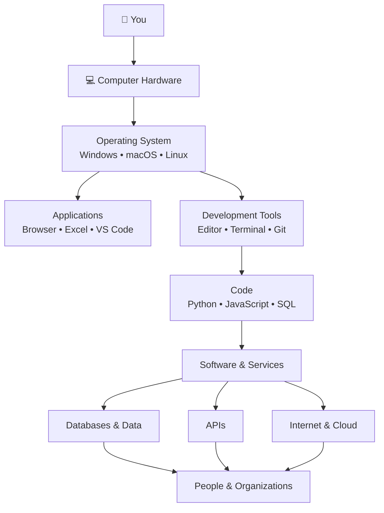
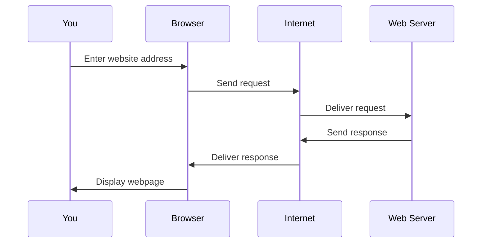
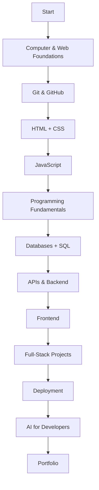
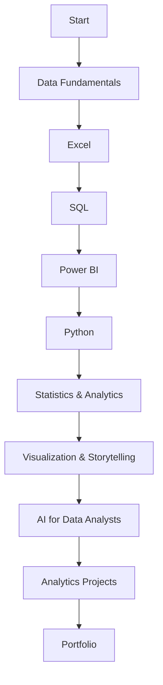
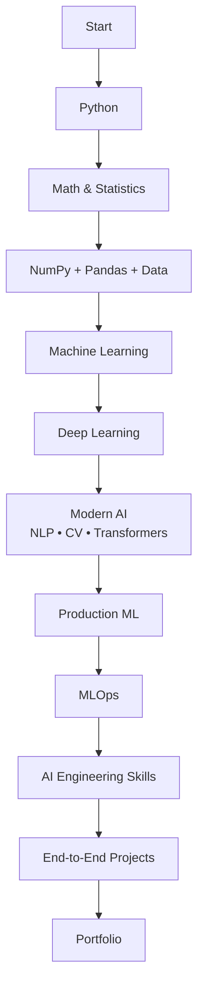

# How to Start Learning Tech: A Complete Beginner's Guide

**Level:** Starter  
**Tutorial:** T00  
**Prerequisites:** None  
**Practice:** [GitHub companion](https://github.com/nelsondsouza/learn-with-nelson/tree/main/start-here/t00-how-to-start-learning-tech)

If you want to become a developer, data analyst, ML engineer—or simply become more comfortable with technology—you may have already encountered words like:

**Python. SQL. Git. GitHub. APIs. Cloud. Terminal. Database. IDE. Machine Learning.**

The problem isn't that any one of these is impossibly difficult.

The problem is that beginners are often shown the pieces **before anyone shows them the picture**.

That's what this tutorial fixes.

You don't need to master programming today. You don't even need to choose a career today.

First, let's build a mental map of the technology world.

---

## 1. What You'll Learn

By the end of this tutorial, you'll understand—in plain English:

- hardware and software
- operating systems
- files and folders
- browsers
- the internet and the web
- programming and source code
- programming languages
- code editors and IDEs
- terminals
- Git and GitHub
- databases and SQL
- APIs
- cloud computing
- artificial intelligence
- how these pieces connect
- the basic differences between a Developer, Data Analyst, and ML Engineer

The objective isn't memorization. It's recognition.

---

## 2. Before You Start

### Required

- a computer or laptop
- internet connection
- a modern web browser
- curiosity

### Software installation

**None.**

We're deliberately not starting by installing Python, Git, VS Code, Docker, or ten other applications.

Those installations will come when we actually need them, with step-by-step instructions.

### GitHub companion

The exercises, solutions, resources, and diagram sources for this tutorial are in the [T00 GitHub companion](https://github.com/nelsondsouza/learn-with-nelson/tree/main/start-here/t00-how-to-start-learning-tech).

---

## 3. Understand It

### Start with the biggest picture



!!! info "Diagram source"
    Mermaid source is also stored in the GitHub companion under `diagrams/technology-big-picture.mmd`.

### Hardware and software

**Hardware** is the physical equipment: processor, memory, storage, monitor, keyboard, and other components.

**Software** is the collection of programs and instructions that tell computers what to do.

A useful beginner mental model is:

> **Hardware is the machine. Software tells the machine what to do.**

### Operating system

Your operating system manages the computer and provides an environment for applications.

Common examples include Windows, macOS, Linux, Android, and iOS.

### Files and folders

A **file** stores information. A **folder** organizes files and other folders.

Programmers work with files too:

```text
app.py
index.html
styles.css
customers.sql
```

You'll also hear the word **directory**. For now, folder and directory refer to the same basic idea.

### Browser, internet, and web

A **browser** such as Chrome, Edge, Firefox, or Safari is an application.

The **internet** is the global network connecting computers and networks.

The **web** is a system of websites and web resources that operates using the internet.

> **The web uses the internet.**

A deliberately simplified web request looks like this:



We'll introduce DNS, HTTP, HTTPS, TCP/IP, TLS, caching and other details only when they become useful.

### Programming and source code

Programming means creating instructions that computers can execute.

Programming languages include Python, JavaScript, Java, C#, C++, Go, and many others.

Source code is the human-readable text programmers write:

```python
print("Hello, world!")
```

You don't need to analyze the syntax yet.

### Code editors and IDEs

A **code editor** is designed for writing and editing source code. We'll initially use Visual Studio Code.

An **IDE**—Integrated Development Environment—combines several development tools into one application.

For now, understand the purpose rather than memorizing the distinction.

### Terminal

A terminal is a text-based interface for interacting with a computer.

Instead of clicking buttons, you type commands:

```text
cd projects
```

We'll learn terminals safely from zero in T03.

### Git and GitHub

**Git** is a version-control system. It helps track changes to files over time.

**GitHub** is an online platform that hosts Git repositories and adds collaboration features.

> **Git is not GitHub.**

### Databases and SQL

Databases help software store, organize, retrieve, and manage data.

Examples include PostgreSQL, MySQL, SQLite, SQL Server, and MongoDB.

SQL is a language widely used with relational databases:

```sql
SELECT name
FROM customers;
```

### APIs

API means **Application Programming Interface**.

A useful beginner definition is:

> **An API gives software a defined way to interact with other software.**

A weather application, for example, might request weather data from another service through an API.

### Cloud computing

Cloud computing provides computing resources over networks rather than requiring everything to run on your own computer.

Major platforms include Amazon Web Services, Microsoft Azure, and Google Cloud.

### Artificial intelligence

Modern AI tools can explain concepts, generate code, analyze data, summarize, brainstorm, debug, test, and review work.

But AI can also be wrong.

Our learning rule is:

> **Ask → Understand → Verify → Apply**

AI will assist learning, not replace understanding.

### Three starting career paths

#### Developer



#### Data Analyst



#### ML Engineer



These are simplified orientation maps. The full career curricula contain considerably more detail.

---

## 4. Follow Along

### Step 1 — Identify your operating system

Write down whether you're using Windows, macOS, Linux, or something else.

### Step 2 — Find a file

Open your file manager and locate one document or image.

Identify its filename, extension, folder, and size.

### Step 3 — Identify your browser

Look at the browser you're using to read this page.

Remember: **the browser is an application; it is not the internet.**

### Step 4 — Look at a website address

Look at the browser address bar.

You may see something resembling:

```text
https://github.com/...
```

For now, simply recognize that your browser is accessing a web resource over the internet.

### Step 5 — Visit the GitHub companion

Open the [T00 GitHub companion](https://github.com/nelsondsouza/learn-with-nelson/tree/main/start-here/t00-how-to-start-learning-tech).

Notice the `diagrams`, `exercises`, and `solutions` folders.

### Step 6 — Open a Mermaid file

Open `diagrams/technology-big-picture.mmd`.

You're looking at **diagram-as-code**—a reproducible visual described using text.

---

## 5. Try It Yourself

Explain, in your own words:

1. hardware vs software
2. internet vs web
3. Git vs GitHub

Then decide which concept best matches each task:

- store customer records
- track changes to source code
- host a Git repository online
- let two software systems exchange information
- query a relational database

Complete the full [`technology-map.md`](https://github.com/nelsondsouza/learn-with-nelson/blob/main/start-here/t00-how-to-start-learning-tech/exercises/technology-map.md) exercise before looking at the example solution.

---

## 6. Common Mistakes

### Trying to learn everything simultaneously

You do not need Python + JavaScript + Java + SQL + AWS + Docker + Kubernetes + React + AI immediately.

Follow a path.

### Confusing Git with GitHub

**Git = version control**  
**GitHub = online Git hosting and collaboration platform**

### Thinking the internet and web are identical

The web operates over the internet.

### Copying code without understanding it

Code that runs isn't necessarily code you understand.

### Installing everything

We'll install tools only when we need them.

### Tutorial hopping

Following a coherent sequence and practicing is more valuable than endlessly switching crash courses.

---

## 7. Use AI 🤖

Instead of asking AI to solve everything, use it as a tutor.

Try:

```text
I am completely new to technology.

Explain the difference between:
1. hardware
2. software
3. operating systems
4. applications

Use one simple example.

Then ask me five questions to test my understanding.

Do not show the answers until I respond.
```

Another useful pattern:

```text
I'm learning technology from zero.

I will explain a concept in my own words.

Do not immediately rewrite my answer.

First:
1. tell me what I understood correctly,
2. identify anything inaccurate,
3. ask me one question that helps me improve my explanation.
```

Keep the rule:

**Ask → Understand → Verify → Apply**

---

## 8. Mini Challenge

Create your own **Technology Map**.

Include:

```text
You
Computer
Hardware
Operating System
Application
Browser
Code
Database
API
Internet
Cloud
User
```

Use paper, PowerPoint, Mermaid, or another diagram tool.

Then explain your map aloud and write down three questions it raises.

---

## 9. Cheat Sheet

| Term | Beginner meaning |
|---|---|
| Hardware | Physical computer equipment |
| Software | Programs and instructions used by computers |
| Operating System | Manages the computer and supports applications |
| File | Stored information with a name |
| Folder / Directory | Organizes files and other folders |
| Browser | Application used to access web resources |
| Internet | Global network connecting computers and networks |
| Web | Websites and resources operating over the internet |
| Programming | Creating instructions for computers |
| Source Code | Human-readable program instructions |
| Programming Language | Language used to express program instructions |
| Code Editor | Application designed for editing source code |
| IDE | Integrated collection of development tools |
| Terminal | Text-based interface for issuing commands |
| Git | Version-control system |
| GitHub | Platform for hosting Git repositories and collaboration |
| Database | System for storing and retrieving organized data |
| SQL | Language commonly used with relational databases |
| API | Defined interface through which software can interact |
| Cloud Computing | Computing resources delivered over networks |
| AI | Systems capable of language, generation, prediction, pattern recognition, and related tasks |

---

## 10. What You Now Know

You now recognize the basic relationships between hardware, software, operating systems, applications, files, browsers, the web, programming, development tools, Git, GitHub, databases, APIs, cloud computing, and AI.

Most importantly:

> **You do not need to learn everything at once. You need the right next step.**

---

## 11. Next Tutorial

### T01 — How Computers Work

Next we'll go underneath the applications and begin understanding the machine itself:

- CPU
- memory (RAM)
- storage
- input and output
- bits and bytes
- programs and processes
- what happens when a computer runs a program
- why these concepts matter to Developers, Data Analysts, and ML Engineers

Before moving on, complete the [T00 exercise](https://github.com/nelsondsouza/learn-with-nelson/tree/main/start-here/t00-how-to-start-learning-tech/exercises).

[Open the T00 GitHub companion](https://github.com/nelsondsouza/learn-with-nelson/tree/main/start-here/t00-how-to-start-learning-tech){ .md-button }

**You now have the map. Next, we'll start exploring the territory.**
